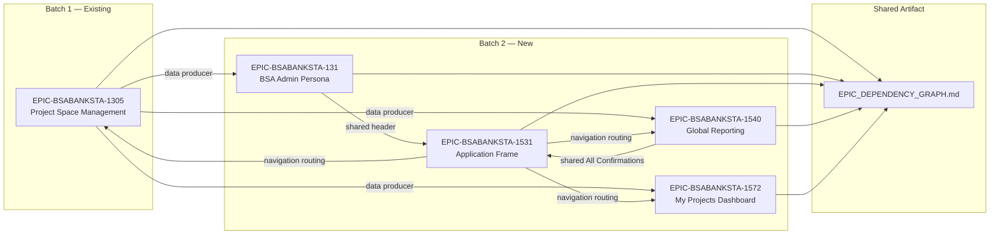

# Technical Specification

# 0. Agent Action Plan

## 0.1 Intent Clarification

### 0.1.1 Core Feature Objective

Based on the prompt, the Blitzy platform understands that the new feature requirement is to **ingest, analyze, transform, and produce a complete set of BDD-style backlog documentation artifacts** for four new epics in the BSA Banking Confirmations system, integrating them with one existing epic from Batch 1. This is a **documentation-generation task** — not application code generation — operating within the `aud-tech-confirmations-blitzy` specification repository.

The feature requirements are:

- **Ingest and Analyze Batch 2 Requirements**: Read the `Requirements - Batch 2.pdf` source document to extract and understand four new epics and their associated child user stories:
  - BSA Admin Persona Epic (`BSABANKSTA-131`) — Administrative capabilities for system message management, user management, and integration audit trail reporting
  - My Projects Dashboard (`BSABANKSTA-1572`) — Personalized dashboard view of active BSA confirmation projects
  - Global Views and Reporting (`BSABANKSTA-1540`) — Cross-project reporting and global confirmation views
  - Application Frame and Global Navigation (`BSABANKSTA-1531`) — Persistent application shell, landing page, help/support, profile management, and navigation framework

- **Apply Eight Global Transformation Rules**: Process all raw requirements through a standardized ruleset before generating any output:
  - Rule 1: Generate detailed epic descriptions with Strategic Goal, Business Context, Key Features, and Out of Scope sections
  - Rule 2: Proactively decompose stories with >10 ACs or multiple distinct workflows into sub-stories (`STORY-[ID]-A`, `-B`)
  - Rule 3: Standardize all story titles to Verb-Noun format
  - Rule 4: Globally override pagination patterns with lazy load / infinite scroll
  - Rule 5: Treat Jira requirements as source of truth over Figma; flag Figma-only elements for discrepancy review
  - Rule 6: Extract performance targets and NFRs into dedicated sections per story
  - Rule 7: Catalog configurable placeholders (e.g., `[Application Name]`) per epic
  - Rule 8: Generate UI specifications for undepicted elements using a 4-step design token SOP

- **Generate Structured Documentation Artifacts**: Create EPIC and STORY markdown files adhering to a strict 14-section template that includes BDD acceptance criteria (Given/When/Then), INVEST validation, AI-centric sub-task decomposition (Model, API, Component, Logic, Testing), edge cases, and cross-epic dependency links

- **Create Cross-Epic Integration Artifacts**: Produce a master `EPIC_DEPENDENCY_GRAPH.md` with a Mermaid `graph LR` diagram visualizing dependencies across all five epics (Batch 1 + Batch 2)

- **Update Existing Batch 1 Documentation**: Modify the existing `EPIC-BSABANKSTA-1305-create-modify-project-space.md` file to incorporate new Batch 2 workflows and dependencies into its Mermaid flow diagram

**Implicit Requirements Detected:**

- Cross-batch bidirectional traceability must be established — every Batch 2 story must reference its dependencies on Batch 1 stories, and vice versa
- A Figma design token manifest must be constructed from the Assets panel before processing any stories (Global Rule #8, Step 1)
- Story estimation must use Fibonacci points with rationale for each story
- Every story must include a Definition of Done checklist at both epic and story levels
- The decomposition logic requires counting ACs per raw requirement and detecting multi-workflow patterns to trigger automatic sub-story splitting

### 0.1.2 Special Instructions and Constraints

**Critical Directives:**

- **Jira-over-Figma Precedence**: Jira requirement text is the authoritative source of truth. UI elements present in Figma wireframes but absent from Jira requirements must be excluded from acceptance criteria and flagged in a `### Discrepancy Review` section (Global Rule #5, CC-RQ-012)
- **Pagination Elimination**: All references to "pagination" in source requirements must be ignored and replaced with lazy load / infinite scroll acceptance criteria. This override must be noted in `### Refinement Notes` (Global Rule #4, CC-RQ-001)
- **14-Section Story Template Compliance**: Every story file must contain exactly these sections: Story Title, User Story, INVEST Validation, NFRs, Acceptance Criteria (BDD), Sub-Tasks, Edge Cases, Dependencies, Story Estimation Guidance, Refinement Notes, Discrepancy Review, Generated UI Specifications, Figma Mockup Link, and Definition of Done
- **Design Token Manifest Construction**: Before processing any stories, the Figma Assets panel must be analyzed to build a manifest of Colors, Typography, Spacing, Border Radii, and Effects — this manifest drives the Generated UI Specifications SOP
- **Verb-Noun Title Standardization**: All story titles must follow the pattern "Verb Noun" (e.g., "Manage System Messages", "Implement Tab Navigation"). Original titles must be preserved in `### Refinement Notes` when changed (Global Rule #3, CC-RQ-007)

**Architectural Requirements:**

- All documentation must be generated within the `tickets/` directory hierarchy following the prescribed folder structure
- Epic files must include: EPIC TITLE, EPIC SUMMARY, USER STORIES INDEX, DEPENDENCIES, SYSTEM PLACEHOLDERS, and DEFINITION OF DONE
- Sub-stories created by decomposition must use the naming convention `STORY-[ID]-A`, `STORY-[ID]-B`, etc.
- The updated Batch 1 epic file must produce a single, holistic Mermaid application workflow diagram incorporating both batches

**User-Provided Examples:**

- User Example (File Structure):
```
tickets/
├── EPIC_DEPENDENCY_GRAPH.md
├── EPIC-BSABANKSTA-131-admin-persona/
├── EPIC-BSABANKSTA-1531-application-frame-global-navigation/
├── EPIC-BSABANKSTA-1540-global-views-reporting/
├── EPIC-BSABANKSTA-1572-my-projects-dashboard/
└── EPIC-BSABANKSTA-1305-create-modify-project-space/
```

- User Example (Naming Convention): "Implement Tabbed Navigation" becomes "Implement Tab Navigation"
- User Example (Generated UI Specifications Warning):
  > **DESIGN REVIEW REQUIRED:** The following UI specifications were automatically generated based on the existing design system tokens, as no explicit mockup was provided for these elements. Please review for accuracy and design intent before development.

### 0.1.3 Technical Interpretation

These feature requirements translate to the following technical implementation strategy:

- **To generate the four new epic documentation files**, we will CREATE one `EPIC-[ID]-[slug].md` file per epic in the `tickets/` directory, each containing a structured summary with Strategic Goal, Business Context, Key Features, Out of Scope, a USER STORIES INDEX linking to child story files, DEPENDENCIES referencing other epics, SYSTEM PLACEHOLDERS cataloging configurable variables, and an epic-level DEFINITION OF DONE checklist

- **To generate all Batch 2 story files**, we will CREATE individual `STORY-[ID]-[slug].md` files within their parent epic directories, each strictly adhering to the 14-section template. For each story, we will:
  - Transform the raw requirement into a `Given/When/Then` BDD acceptance criteria set
  - Validate the story against INVEST principles (Independent, Negotiable, Valuable, Estimable, Small, Testable)
  - Decompose sub-tasks into five AI-centric categories: Model, API, Component, Logic, Testing
  - Generate 3–5 edge cases per story
  - Map cross-epic dependencies spanning all five epics
  - Assign Fibonacci-based story points with rationale
  - Apply all eight global rules and document any transformations in Refinement Notes

- **To produce the cross-epic dependency graph**, we will CREATE `tickets/EPIC_DEPENDENCY_GRAPH.md` containing a Mermaid `graph LR` diagram that visualizes the dependency relationships between all five epics: `BSABANKSTA-1305` (Batch 1), `BSABANKSTA-131`, `BSABANKSTA-1572`, `BSABANKSTA-1540`, and `BSABANKSTA-1531` (Batch 2)

- **To update the existing Batch 1 epic**, we will MODIFY `tickets/EPIC-BSABANKSTA-1305-create-modify-project-space.md` (or CREATE it if absent) to extend its Mermaid flow diagram with the new Batch 2 user workflows and cross-epic dependency links, creating a unified application workflow visualization

- **To construct the design token manifest**, we will analyze the Figma design file's Assets panel (file ID `6fQyfvBUqImyavY8Fw47FV`) to extract tokens across five categories (Colors, Typography, Spacing, Border Radii, Effects), then apply the three-tier priority hierarchy (1. Reuse component → 2. Semantic tokens → 3. Base tokens) when generating UI specifications for undepicted elements

- **To enforce the pagination-to-lazy-load override**, we will scan all source requirements for pagination references, replace them with lazy load / infinite scroll acceptance criteria using the cursor-based data loading pattern, and document each override in the story's Refinement Notes section

## 0.2 Repository Scope Discovery

### 0.2.1 Comprehensive File Analysis

**Current Repository State:**

The `aud-tech-confirmations-blitzy` repository currently contains a single file at its root:

| Path | Type | Status | Purpose |
|------|------|--------|---------|
| `README.md` | File | EXISTING (UNCHANGED) | Operational specification governing the entire documentation-generation pipeline — defines epics, global rules, output structure, Figma integration, design token methodology, and the 5-step transformation pipeline |

No `tickets/` directory, no application source code, no configuration files, and no build scripts exist in the repository. The repository is exclusively a documentation and specification artifact — all application code generation is handled downstream by the Blitzy Platform.

**Existing Batch 1 Artifacts (To Be Located or Created):**

The operational specification references existing Batch 1 documentation under `tickets/EPIC-BSABANKSTA-1305-create-modify-project-space/`. Since no `tickets/` directory is currently present at the repository root, these artifacts must either be generated as part of the current task or treated as expected pre-existing inputs that need creation.

| Expected Path | Status | Action Required |
|--------------|--------|-----------------|
| `tickets/EPIC-BSABANKSTA-1305-create-modify-project-space/` | NOT FOUND at root | CREATE directory and epic file, or UPDATE if generated by a prior pipeline stage |
| `tickets/EPIC-BSABANKSTA-1305-create-modify-project-space.md` | NOT FOUND | CREATE or UPDATE to incorporate Batch 2 cross-epic dependencies and extended Mermaid diagram |

**New Directories to Create:**

| Directory Path | Epic Reference | Purpose |
|---------------|----------------|---------|
| `tickets/` | All epics | Root documentation directory for all specification artifacts |
| `tickets/EPIC-BSABANKSTA-131-admin-persona/` | `BSABANKSTA-131` | Container for BSA Admin Persona story files |
| `tickets/EPIC-BSABANKSTA-1531-application-frame-global-navigation/` | `BSABANKSTA-1531` | Container for Application Frame and Global Navigation story files |
| `tickets/EPIC-BSABANKSTA-1540-global-views-reporting/` | `BSABANKSTA-1540` | Container for Global Views and Reporting story files |
| `tickets/EPIC-BSABANKSTA-1572-my-projects-dashboard/` | `BSABANKSTA-1572` | Container for My Projects Dashboard story files |

**New Epic-Level Files to Create:**

| File Path | Purpose |
|-----------|---------|
| `tickets/EPIC_DEPENDENCY_GRAPH.md` | Master cross-epic dependency visualization with Mermaid `graph LR` diagram spanning all 5 epics |
| `tickets/EPIC-BSABANKSTA-131-admin-persona/EPIC-BSABANKSTA-131-admin-persona.md` | Epic file with structured summary, story index, dependencies, system placeholders, and DoD |
| `tickets/EPIC-BSABANKSTA-1531-application-frame-global-navigation/EPIC-BSABANKSTA-1531-application-frame-global-navigation.md` | Epic file for Application Frame and Global Navigation |
| `tickets/EPIC-BSABANKSTA-1540-global-views-reporting/EPIC-BSABANKSTA-1540-global-views-reporting.md` | Epic file for Global Views and Reporting |
| `tickets/EPIC-BSABANKSTA-1572-my-projects-dashboard/EPIC-BSABANKSTA-1572-my-projects-dashboard.md` | Epic file for My Projects Dashboard |

**New Story Files to Create (by Epic):**

**Epic: BSA Admin Persona (`BSABANKSTA-131`) — 3 user stories, 10 Figma frames:**

| File Path | Story ID | Description | Figma Frames |
|-----------|----------|-------------|--------------|
| `tickets/EPIC-BSABANKSTA-131-admin-persona/STORY-BSABANKSTA-1579-*.md` | `BSABANKSTA-1579` | Manage Global System Messages — Create/Edit Modal | 6 frames (`8304-120310`, `8304-120342`, `8304-120318`, `8304-123107`, `8304-123120`, `8304-123149`) |
| `tickets/EPIC-BSABANKSTA-131-admin-persona/STORY-BSABANKSTA-1500-*.md` | `BSABANKSTA-1500` | Application Header — Admin Settings — User Management Library | 1 frame (`7178-133386`) |
| `tickets/EPIC-BSABANKSTA-131-admin-persona/STORY-BSABANKSTA-1458-*.md` | `BSABANKSTA-1458` | Admin — Reporting — Integration Audit Trail | 3 frames (`7408-96357`, `7437-87603`, `7485-99556`) |

> **Note:** `BSABANKSTA-1579` has 6 Figma frames representing multiple modal states (create, edit, confirmation, etc.). Per Global Rule #2, if this story exceeds 10 ACs or contains distinct create and edit workflows, it must be decomposed into `STORY-BSABANKSTA-1579-A` (Create flow) and `STORY-BSABANKSTA-1579-B` (Edit flow).

**Epic: Application Frame and Global Navigation (`BSABANKSTA-1531`) — 3 user stories, 4 Figma frames:**

| File Path | Story ID | Description | Figma Frames |
|-----------|----------|-------------|--------------|
| `tickets/EPIC-BSABANKSTA-1531-application-frame-global-navigation/STORY-BSABANKSTA-1509-*.md` | `BSABANKSTA-1509` | Configurable Help & Support Page | 1 frame (`7542-109669`) |
| `tickets/EPIC-BSABANKSTA-1531-application-frame-global-navigation/STORY-BSABANKSTA-1536-*.md` | `BSABANKSTA-1536` | Reporting — All Confirmations Page | 1 frame (`8241-118805`) |
| `tickets/EPIC-BSABANKSTA-1531-application-frame-global-navigation/STORY-BSABANKSTA-1532-*.md` | `BSABANKSTA-1532` | Application Header — Profile Dropdown Menu | 2 frames (`8238-118805`, `8304-123177`) |

**Epic: Global Views and Reporting (`BSABANKSTA-1540`) — stories to be extracted from PDF:**

| File Path Pattern | Purpose |
|-------------------|---------|
| `tickets/EPIC-BSABANKSTA-1540-global-views-reporting/STORY-BSABANKSTA-*-*.md` | Story files for cross-project reporting views and global confirmation data aggregation; no dedicated Figma frames (requirements-driven UI specs) |

> **Note:** F-004 does not have dedicated Figma frames. All UI specifications for this epic's stories will be generated using the 4-step Generated UI Specifications SOP with the `DESIGN REVIEW REQUIRED` warning banner.

**Epic: My Projects Dashboard (`BSABANKSTA-1572`) — stories to be extracted from PDF, 3 Figma frames:**

| File Path Pattern | Purpose | Figma Frames |
|-------------------|---------|--------------|
| `tickets/EPIC-BSABANKSTA-1572-my-projects-dashboard/STORY-BSABANKSTA-*-*.md` | Story files for personalized project dashboard views | 3 frames (`7646-212204`, `7646-213105`, `7646-211031`) |

**Integration Point Discovery:**

| Integration Point | Affected Epics | Documentation Impact |
|-------------------|---------------|---------------------|
| Cross-Epic Dependency Graph | All 5 epics | `EPIC_DEPENDENCY_GRAPH.md` must visualize `BSABANKSTA-1305 → 131, 1572, 1540, 1531` data dependencies and `BSABANKSTA-1531 → 1305, 1572, 1540` navigation routing |
| Shared All Confirmations Page | `BSABANKSTA-1540` (data) + `BSABANKSTA-1531` (navigation) | Story `BSABANKSTA-1536` must cross-reference F-004 reporting data logic |
| Application Header | `BSABANKSTA-131` (Admin Settings) + `BSABANKSTA-1531` (Profile Dropdown) | Both epics share the Application Header component — mutual dependency links required |
| Project Space Entities | `BSABANKSTA-1305` (producer) → `131, 1572, 1540` (consumers) | Dashboard, reporting, and admin stories must declare data dependency on F-001 project entities |
| Lazy Load / Infinite Scroll | `BSABANKSTA-131, 1572, 1540, 1531` | Every list-view story must include infinite scroll ACs — global pattern documented across epics |
| Batch 1 Flow Diagram Update | `BSABANKSTA-1305` | Existing epic Mermaid diagram must be extended with Batch 2 navigation routes and data flows |

### 0.2.2 Web Search Research Conducted

The following research areas informed the documentation generation approach:

- **BDD (Behavior-Driven Development) best practices**: The Given/When/Then format for acceptance criteria is well-established. All stories will follow the standard Gherkin-style BDD format with precondition (Given), action (When), and expected outcome (Then) clauses
- **INVEST principles for user story validation**: Each story must be validated as Independent, Negotiable, Valuable, Estimable, Small, and Testable — documented in a dedicated table per story
- **Fibonacci estimation guidance**: Story points use the Fibonacci sequence (1, 2, 3, 5, 8, 13, 21) with rationale based on complexity, uncertainty, and effort for each story
- **Lazy load / infinite scroll patterns for compliance dashboards**: Cursor-based pagination with React Intersection Observer API replaces traditional page-number pagination across all list views
- **BSA/AML compliance UI patterns**: Banking confirmation systems require audit-grade traceability, immutable logging, and role-based access control — all reflected in story acceptance criteria and edge cases
- **Mermaid diagram syntax for dependency graphs**: `graph LR` syntax is used for the cross-epic dependency graph; `flowchart TD` for application workflow diagrams within epic files

### 0.2.3 New File Requirements

**Summary of All Files to Be Created:**

| Category | Count | File Pattern |
|----------|-------|--------------|
| Cross-Epic Dependency Graph | 1 | `tickets/EPIC_DEPENDENCY_GRAPH.md` |
| New Epic Files | 4 | `tickets/EPIC-BSABANKSTA-[ID]-[slug]/EPIC-BSABANKSTA-[ID]-[slug].md` |
| Updated Epic File (Batch 1) | 1 | `tickets/EPIC-BSABANKSTA-1305-create-modify-project-space.md` |
| New Story Files (BSABANKSTA-131) | 3+ | `tickets/EPIC-BSABANKSTA-131-admin-persona/STORY-BSABANKSTA-[ID]-[slug].md` |
| New Story Files (BSABANKSTA-1531) | 3+ | `tickets/EPIC-BSABANKSTA-1531-application-frame-global-navigation/STORY-BSABANKSTA-[ID]-[slug].md` |
| New Story Files (BSABANKSTA-1540) | TBD | `tickets/EPIC-BSABANKSTA-1540-global-views-reporting/STORY-BSABANKSTA-[ID]-[slug].md` |
| New Story Files (BSABANKSTA-1572) | TBD | `tickets/EPIC-BSABANKSTA-1572-my-projects-dashboard/STORY-BSABANKSTA-[ID]-[slug].md` |

> **Note:** The exact count of story files depends on: (a) the number of child stories extracted from `Requirements - Batch 2.pdf`, and (b) the number of decomposition splits triggered by Global Rule #2 (stories with >10 ACs or multiple distinct workflows). Known stories from Figma mapping total 9 unique story IDs; additional stories may be identified from the PDF.

## 0.3 Dependency Inventory

### 0.3.1 Private and Public Packages

This project is a **documentation-generation task** operating within a specification repository that contains no application source code. The output artifacts are structured markdown files — not compiled software. Therefore, the dependency inventory focuses on two categories: (a) the tooling dependencies used during the documentation generation pipeline, and (b) the technology stack dependencies that the generated documentation references for downstream code generation by the Blitzy Platform.

**Documentation Pipeline Tooling:**

| Registry | Package | Version | Purpose |
|----------|---------|---------|---------|
| System | Markdown (spec format) | N/A | All output artifacts use standard GitHub-Flavored Markdown (GFM) |
| System | Mermaid | Latest (rendered by GitHub/Figma viewers) | Diagrams in `EPIC_DEPENDENCY_GRAPH.md` and epic flow diagrams use Mermaid `graph LR` and `flowchart TD` syntax |
| PyPI (reference) | Python | 3.13.x | Backend runtime referenced in generated sub-task documentation |
| npm (reference) | Node.js | ≥ 20.x LTS | Frontend runtime referenced in generated sub-task documentation |

**Application Stack Dependencies Referenced in Generated Stories:**

The following packages are documented within the generated story sub-tasks (Model, API, Component, Logic, Testing categories) to guide the Blitzy Platform's downstream code generation:

| Registry | Package | Version | Role in Generated Documentation |
|----------|---------|---------|-------------------------------|
| PyPI | Flask | 3.1.3 | Backend API framework — referenced in API sub-tasks for route/blueprint definitions |
| PyPI | Marshmallow | 3.x | Input validation — referenced in Model sub-tasks for schema definitions |
| PyPI | Flask-PyMongo / PyMongo | 2.x / 4.x | MongoDB driver — referenced in Model sub-tasks for data persistence |
| PyPI | authlib / pyjwt | Latest | JWT validation — referenced in Logic sub-tasks for authentication enforcement |
| PyPI | Flask-CORS | 4.x | CORS handling — referenced in API sub-tasks for cross-origin configuration |
| PyPI | pytest | 8.x | Unit testing — referenced in Testing sub-tasks |
| PyPI | behave | 1.x | BDD test runner — referenced in Testing sub-tasks for acceptance criteria validation |
| npm | React | 19.2.4 | UI component library — referenced in Component sub-tasks |
| npm | TypeScript | 5.9.x | Frontend type safety — referenced in Component sub-tasks |
| npm | TailwindCSS | 4.2.1 | CSS framework — referenced in Component sub-tasks for design token application |
| npm | Vite | 6.x | Build tool — referenced in Component sub-tasks |
| npm | React Router | 7.x | Client-side routing — referenced in Component sub-tasks for navigation |
| npm | @auth0/auth0-react | SPA SDK | Authentication — referenced in Logic sub-tasks for session management |
| npm | Vitest | 3.x | Unit testing — referenced in Testing sub-tasks |
| npm | @testing-library/react | 16.x | Component testing — referenced in Testing sub-tasks |
| npm | Playwright | 1.x | E2E testing — referenced in Testing sub-tasks |
| Managed Service | MongoDB | 8.0 (Atlas) | Primary data store — referenced in Model sub-tasks for collection schema design |
| Managed Service | Auth0 | Cloud | Identity provider — referenced in Logic sub-tasks for OAuth 2.0/OIDC flows |
| Managed Service | LangChain | 1.2.x | AI integration — referenced in Logic sub-tasks for Blitzy Platform communication |

### 0.3.2 Dependency Updates

**Cross-Epic Dependency Links (Documentation-Level):**

Since this is a documentation task, "dependency updates" refer to the cross-referencing and interlinking required between documentation artifacts rather than import or package changes.

- **Import-Equivalent Updates — Cross-Epic References:**
  - All Batch 2 story files must include a `### Dependencies` section linking to related stories in `BSABANKSTA-1305` (Batch 1)
  - The existing `EPIC-BSABANKSTA-1305-create-modify-project-space.md` must be updated to include reverse dependency links to all four Batch 2 epics
  - Story `BSABANKSTA-1536` (All Confirmations Page) in the Application Frame epic must cross-reference F-004 reporting logic in the Global Views epic
  - Stories in `BSABANKSTA-131` that reference the Application Header must link to `BSABANKSTA-1532` (Profile Dropdown) in the Application Frame epic

- **External Reference Updates:**
  - `tickets/EPIC_DEPENDENCY_GRAPH.md`: New file — must reference all five epics with correct Mermaid node IDs
  - All Batch 2 story files must include `### Figma Mockup Link` sections with direct URLs to the corresponding Figma frames (17 unique frames across 7 story groupings)
  - Every story must include `### Sub-Tasks` decomposed into the five AI-centric categories (Model, API, Component, Logic, Testing) with references to the specific technology stack packages listed above

- **Configuration and Template Updates:**
  - All epic files must include a `### System Placeholders` section cataloging configurable variables (e.g., `[Application Name]`, environment-specific URLs)
  - All story files must contain the complete 14-section template — any section that does not apply to a specific story should be present but marked as "N/A" or "None identified"
  - Refinement Notes sections must document every global rule application (pagination override, title standardization, decomposition actions)

## 0.4 Integration Analysis

### 0.4.1 Existing Code Touchpoints

Since the repository is a documentation-only specification artifact, "code touchpoints" refer to the documentation files and structural integration points that connect existing artifacts with the new Batch 2 outputs. All touchpoints are documentation-level modifications.

**Direct Modifications Required:**

| File / Directory | Modification | Integration Detail |
|-----------------|-------------|-------------------|
| `tickets/EPIC-BSABANKSTA-1305-create-modify-project-space.md` | UPDATE Mermaid flow diagram | Extend the existing application workflow diagram to include Batch 2 navigation routes (F-005 → F-001, F-003, F-004), data dependencies (F-002, F-003, F-004 → F-001), and shared component references (All Confirmations Page co-dependency between F-004 and F-005) |
| `tickets/EPIC-BSABANKSTA-1305-create-modify-project-space.md` | ADD cross-epic dependency section | Insert bidirectional dependency links to all four Batch 2 epics: `BSABANKSTA-131`, `BSABANKSTA-1531`, `BSABANKSTA-1540`, `BSABANKSTA-1572` |
| `tickets/` (root directory) | CREATE if absent | The `tickets/` directory must exist as the root container for all documentation artifacts |

**Cross-Epic Dependency Injection Points:**



**Story-Level Integration Matrix:**

The following table maps every known inter-epic story dependency that must be documented in the `### Dependencies` section of each story file:

| Source Story | Source Epic | Target Story/Feature | Target Epic | Dependency Type |
|-------------|------------|---------------------|-------------|-----------------|
| `BSABANKSTA-1579` (System Messages) | 131 | Application Header component | 1531 | UI Container dependency — modal launched from admin area within Application Header |
| `BSABANKSTA-1500` (User Management) | 131 | `BSABANKSTA-1532` (Profile Dropdown) | 1531 | Shared Application Header — admin settings and profile dropdown coexist in same header |
| `BSABANKSTA-1458` (Audit Trail) | 131 | Project Space entities (F-001) | 1305 | Data dependency — audit trail logs project space lifecycle events |
| `BSABANKSTA-1536` (All Confirmations) | 1531 | Global Reporting data (F-004) | 1540 | Shared surface — F-005 provides navigation, F-004 provides data aggregation |
| `BSABANKSTA-1509` (Help & Support) | 1531 | System Placeholders | All | Configurable content uses `[Application Name]` and similar deployment variables |
| `BSABANKSTA-1532` (Profile Dropdown) | 1531 | `BSABANKSTA-1500` (Admin Settings) | 131 | Shared Application Header — profile and admin settings are siblings in the header component |
| All Dashboard stories | 1572 | Project Space CRUD (F-001) | 1305 | Data dependency — dashboard displays project entities created/managed by F-001 |
| All Reporting stories | 1540 | Project Space entities (F-001) | 1305 | Data dependency — reports aggregate across all F-001 project spaces |
| All list-view stories | 131, 1572, 1540, 1531 | Lazy Load / Infinite Scroll (CC-RQ-001) | Cross-cutting | UI pattern dependency — all list views implement shared infinite scroll behavior |

**Database/Schema Documentation Updates:**

While no actual database schema changes are in scope (C-004), the generated story sub-tasks must reference the following MongoDB collections in their Model decomposition:

| Collection | Referenced By Stories In | Sub-Task Category |
|-----------|------------------------|-------------------|
| Project Spaces | 1572 (Dashboard), 1540 (Reporting), 1305 (CRUD) | Model — query patterns for project data retrieval |
| System Messages | 131 (`BSABANKSTA-1579`) | Model — create/update message documents with visibility config |
| Audit Trail | 131 (`BSABANKSTA-1458`) | Model — append-only read queries for audit event retrieval |
| Reporting Views | 1540 (Global Views) | Model — MongoDB aggregation pipeline for cross-project consolidation |
| Configuration | 1531 (`BSABANKSTA-1509`) | Model — key-value read for configurable help/support content |

## 0.5 Design System Compliance

The BSA Banking Confirmations system employs a formal design system architecture flowing from the Figma design file through a design token pipeline into TailwindCSS utility classes rendered by React components. This section documents the design system alignment requirements that govern all Generated UI Specifications within the Batch 2 story files.

### 0.5.1 System Identification

| Attribute | Value |
|-----------|-------|
| **Library** | TailwindCSS |
| **Version** | 4.2.1 |
| **Status** | Referenced in tech spec — to be installed during downstream code generation |
| **Package** | npm / tailwindcss |
| **Build Integration** | `@tailwindcss/vite` plugin (first-party) |
| **Source** | Figma file `6fQyfvBUqImyavY8Fw47FV` ("BSA Wireframes") — design token source of truth |
| **Documentation URL** | `https://www.figma.com/design/6fQyfvBUqImyavY8Fw47FV/BSA-Wireframes` |

The design system pipeline operates as: **Figma Assets Panel → Design Token Manifest → TailwindCSS CSS Custom Properties → React Component Classes → Browser Rendering**.

### 0.5.2 Design Token Categories

The design token manifest must be constructed from the Figma Assets panel (CC-RQ-009) before processing any stories. It encompasses five categories:

| Token Category | Description | TailwindCSS Integration | Application |
|---------------|-------------|------------------------|-------------|
| **Colors** | Brand palette, semantic colors (success, error, warning, info), surface colors, border colors | CSS custom properties mapped to Tailwind color utilities (e.g., `bg-primary`, `text-error`) | All features — consistent color language across F-001 through F-005 |
| **Typography** | Font families, sizes (heading, body, caption, label), weights, line heights, letter spacing | Tailwind typography scale configuration | All features — headings, body text, form labels, table content |
| **Spacing** | Margins, paddings, gaps in a consistent spatial scale (4px, 8px, 12px, 16px, 24px, 32px, etc.) | Tailwind spacing scale configuration (e.g., `p-4`, `gap-6`, `m-8`) | All features — component spacing, section margins, card padding |
| **Border Radii** | Corner radius values for cards, modals, buttons, inputs | Tailwind `rounded-*` utility mapping (e.g., `rounded-lg`, `rounded-md`) | Modals (F-002), cards (F-003), buttons (all features) |
| **Effects** | Shadows, opacity, transitions, focus ring styles | Tailwind shadow and ring utility mapping (e.g., `shadow-md`, `ring-2`) | Modals (F-002), cards (F-003), interactive elements (all features) |

### 0.5.3 Token Priority Hierarchy

When applying design tokens to UI elements — particularly for the Generated UI Specifications SOP (Global Rule #8) — a strict three-tier priority hierarchy governs selection (CC-RQ-010):

| Priority | Strategy | Application | Example |
|----------|----------|-------------|---------|
| 1 (Highest) | **Reuse Similar Existing Component** | If a visually similar component already exists in the Figma design or component library, reuse it to maximize design consistency | A confirmation dialog in F-002 reuses the modal pattern from the System Messages Create/Edit Modal |
| 2 | **Apply Semantic Tokens** | If no reusable component exists, apply semantic tokens that encode design intent | `color-error` for validation messages, `spacing-section` for content gaps |
| 3 (Lowest) | **Apply Base Tokens** | As a last resort, apply raw base tokens with explicit design rationale documented | `#E53E3E` for a custom alert, `16px` for a non-standard spacing |

### 0.5.4 Component Mapping

The following table maps UI elements from the Batch 2 requirements to TailwindCSS / React component patterns:

| UI Element | TailwindCSS Pattern | Relevant Stories | Notes |
|-----------|-------------------|-----------------|-------|
| Modal Dialog (Create/Edit) | Fixed overlay with `bg-white rounded-lg shadow-xl` centered container | `BSABANKSTA-1579` (System Messages) | 6 Figma frames define modal states |
| Data Table with Infinite Scroll | `overflow-auto` container with Intersection Observer trigger row | `BSABANKSTA-1458` (Audit Trail), `BSABANKSTA-1500` (User Mgmt) | Replaces pagination per CC-RQ-001 |
| Dashboard Card Grid | `grid grid-cols-*` with `bg-white rounded-md shadow-sm p-6` cards | `BSABANKSTA-1572` (My Projects Dashboard) | 3 Figma frames |
| Profile Dropdown Menu | Absolute-positioned `bg-white rounded-md shadow-lg` with `divide-y` | `BSABANKSTA-1532` (Profile Dropdown) | 2 Figma frames |
| Application Header Bar | `sticky top-0 bg-white border-b shadow-sm` with flex layout | `BSABANKSTA-1532`, `BSABANKSTA-1500` | Shared across F-002 and F-005 |
| Help & Support Content Page | `max-w-prose mx-auto` with configurable content blocks | `BSABANKSTA-1509` (Help & Support) | 1 Figma frame |
| All Confirmations Table | `table-auto w-full` with sortable headers and infinite scroll | `BSABANKSTA-1536` (All Confirmations) | Shared between F-004 and F-005 |
| Empty State Display | `flex flex-col items-center justify-center py-16 text-gray-500` | All list views | No Figma frame — Generated UI Spec required |
| End-of-List Indicator | `text-center py-4 text-gray-400` with divider | All infinite scroll views | No Figma frame — Generated UI Spec required |
| Error State / Retry | `bg-red-50 border border-red-200 rounded-md p-4` with retry button | All features | No Figma frame — Generated UI Spec required |
| Global Navigation Sidebar/Bar | `fixed left-0 top-0 h-screen bg-gray-900 text-white` or header nav | All features via F-005 | Landing Page and Navigation (implicit, no dedicated Figma frame) |

### 0.5.5 Figma Coverage and Gaps Inventory

**Features WITH Figma Frames (Design-Led):**

| Feature | Figma Frame Count | Coverage |
|---------|------------------|----------|
| F-002: BSA Admin Persona | 10 frames across 3 stories | Full visual coverage for system messages modal, user management, and audit trail |
| F-003: My Projects Dashboard | 3 frames | Full visual coverage for dashboard views |
| F-005: Application Frame | 4 frames across 3 stories | Partial coverage — Help/Support, All Confirmations, and Profile Dropdown covered; Landing Page and Global Navigation Framework are implicit (no dedicated frames) |

**Features WITHOUT Figma Frames (Specification-Driven Gaps):**

| Feature / Component | Gap Type | Resolution Strategy |
|--------------------|----------|-------------------|
| F-001: Project Space Management | No Figma frames (Batch 1, requirements-driven) | Existing Batch 1 stories define UI specs; no new frames needed for Batch 2 updates |
| F-004: Global Views and Reporting | No dedicated Figma frames | All UI specifications must be generated using the 4-step SOP with `DESIGN REVIEW REQUIRED` banner |
| F-005: Landing Page (`F-005-RQ-001`) | Implicit — no dedicated Figma frame | Generated UI Spec required using semantic tokens from the application shell pattern |
| F-005: Global Navigation Framework (`F-005-RQ-002`) | Implicit — no dedicated Figma frame | Generated UI Spec required using navigation patterns derived from the Application Header in existing frames |
| Shared: Empty State Display | No Figma frame | Generated UI Spec using semantic tokens (`text-gray-500`, centered flex layout) |
| Shared: End-of-List Indicator | No Figma frame | Generated UI Spec using base tokens (divider + text indicator) |
| Shared: Error State / Retry | No Figma frame | Generated UI Spec using semantic error tokens (`bg-red-50`, `text-red-700`) |

### 0.5.6 Compliance Summary

The TailwindCSS 4.2.1 design system, sourced from the Figma BSA Wireframes file (`6fQyfvBUqImyavY8Fw47FV`), provides comprehensive design token coverage across five categories (Colors, Typography, Spacing, Border Radii, Effects). Of the 17 unique Figma frames, all frames are mapped to specific features and stories. Three features (F-002, F-003, F-005) have direct Figma coverage; two features (F-001, F-004) plus several shared components require Generated UI Specifications using the three-tier token priority hierarchy. No additional CSS or component library dependencies need to be added — TailwindCSS serves as the single styling framework with CSS-variable-based theming providing the bridge between Figma tokens and React components.

## 0.6 Technical Implementation

### 0.6.1 File-by-File Execution Plan

Every file listed below MUST be created or modified as part of this documentation generation task. Files are organized into execution groups reflecting logical dependency ordering.

**Group 1 — Foundation Artifacts (Create First):**

| Action | File Path | Purpose |
|--------|-----------|---------|
| CREATE | `tickets/` | Root documentation directory (create if absent) |
| CREATE | `tickets/EPIC_DEPENDENCY_GRAPH.md` | Master cross-epic dependency visualization with Mermaid `graph LR` diagram visualizing relationships between all 5 epics (`BSABANKSTA-1305`, `131`, `1531`, `1540`, `1572`) |
| MODIFY or CREATE | `tickets/EPIC-BSABANKSTA-1305-create-modify-project-space.md` | Update existing Batch 1 epic file to extend its Mermaid flow diagram with Batch 2 workflows and add bidirectional cross-epic dependency links |

**Group 2 — Epic Files (4 New Epics):**

| Action | File Path | Purpose |
|--------|-----------|---------|
| CREATE | `tickets/EPIC-BSABANKSTA-131-admin-persona/` | Directory for BSA Admin Persona stories |
| CREATE | `tickets/EPIC-BSABANKSTA-131-admin-persona/EPIC-BSABANKSTA-131-admin-persona.md` | Epic file with structured summary (Strategic Goal, Business Context, Key Features, Out of Scope), USER STORIES INDEX, DEPENDENCIES, SYSTEM PLACEHOLDERS, DEFINITION OF DONE |
| CREATE | `tickets/EPIC-BSABANKSTA-1531-application-frame-global-navigation/` | Directory for Application Frame stories |
| CREATE | `tickets/EPIC-BSABANKSTA-1531-application-frame-global-navigation/EPIC-BSABANKSTA-1531-application-frame-global-navigation.md` | Epic file for Application Frame and Global Navigation |
| CREATE | `tickets/EPIC-BSABANKSTA-1540-global-views-reporting/` | Directory for Global Views and Reporting stories |
| CREATE | `tickets/EPIC-BSABANKSTA-1540-global-views-reporting/EPIC-BSABANKSTA-1540-global-views-reporting.md` | Epic file for Global Views and Reporting |
| CREATE | `tickets/EPIC-BSABANKSTA-1572-my-projects-dashboard/` | Directory for My Projects Dashboard stories |
| CREATE | `tickets/EPIC-BSABANKSTA-1572-my-projects-dashboard/EPIC-BSABANKSTA-1572-my-projects-dashboard.md` | Epic file for My Projects Dashboard |

**Group 3 — Story Files for BSA Admin Persona (`BSABANKSTA-131`):**

| Action | File Path | Story | Content Highlights |
|--------|-----------|-------|--------------------|
| CREATE | `tickets/EPIC-BSABANKSTA-131-admin-persona/STORY-BSABANKSTA-1579-manage-global-system-messages.md` | Manage Global System Messages — Create/Edit Modal | 6 Figma frames; potential decomposition into `-A` (Create) and `-B` (Edit) per Global Rule #2; BDD criteria for modal open/close, field validation, save/cancel, visibility config |
| CREATE | `tickets/EPIC-BSABANKSTA-131-admin-persona/STORY-BSABANKSTA-1500-manage-user-library.md` | Application Header — Admin Settings — User Management Library | 1 Figma frame; lazy load override for user list; BDD criteria for user search, view, manage actions |
| CREATE | `tickets/EPIC-BSABANKSTA-131-admin-persona/STORY-BSABANKSTA-1458-view-integration-audit-trail.md` | Admin — Reporting — Integration Audit Trail | 3 Figma frames; lazy load override for audit log; BDD criteria for event detail display, filtering, scrolling |

> **Decomposition Alert:** `BSABANKSTA-1579` has 6 Figma frames representing distinct create and edit modal workflows. If the source requirement contains >10 ACs or distinct create/edit/delete flows, this story MUST be decomposed into:
> - `STORY-BSABANKSTA-1579-A-create-global-system-message.md`
> - `STORY-BSABANKSTA-1579-B-edit-global-system-message.md`

**Group 4 — Story Files for Application Frame (`BSABANKSTA-1531`):**

| Action | File Path | Story | Content Highlights |
|--------|-----------|-------|--------------------|
| CREATE | `tickets/EPIC-BSABANKSTA-1531-application-frame-global-navigation/STORY-BSABANKSTA-1509-configure-help-support-page.md` | Configurable Help & Support Page | 1 Figma frame; configurable content placeholders; BDD criteria for content display, navigation access, placeholder resolution |
| CREATE | `tickets/EPIC-BSABANKSTA-1531-application-frame-global-navigation/STORY-BSABANKSTA-1536-view-all-confirmations.md` | Reporting — All Confirmations Page | 1 Figma frame; shared surface with F-004; lazy load override; BDD criteria for data loading, infinite scroll, cross-project aggregation |
| CREATE | `tickets/EPIC-BSABANKSTA-1531-application-frame-global-navigation/STORY-BSABANKSTA-1532-manage-profile-dropdown.md` | Application Header — Profile Dropdown Menu | 2 Figma frames; BDD criteria for dropdown toggle, menu items, logout action, profile navigation |

**Group 5 — Story Files for Global Views and Reporting (`BSABANKSTA-1540`):**

| Action | File Pattern | Story | Content Highlights |
|--------|-------------|-------|--------------------|
| CREATE | `tickets/EPIC-BSABANKSTA-1540-global-views-reporting/STORY-BSABANKSTA-*-*.md` | Stories extracted from PDF | No dedicated Figma frames — ALL stories require Generated UI Specifications with `DESIGN REVIEW REQUIRED` banner; lazy load override for all report views; BDD criteria for data aggregation, cross-project filtering, report rendering |

**Group 6 — Story Files for My Projects Dashboard (`BSABANKSTA-1572`):**

| Action | File Pattern | Story | Content Highlights |
|--------|-------------|-------|--------------------|
| CREATE | `tickets/EPIC-BSABANKSTA-1572-my-projects-dashboard/STORY-BSABANKSTA-*-*.md` | Stories extracted from PDF | 3 Figma frames; lazy load override for project list; BDD criteria for personalized view, project selection, dashboard rendering, infinite scroll |

### 0.6.2 Implementation Approach per File

The documentation generation follows a systematic five-phase approach per file:

- **Phase 1 — Requirement Extraction**: Parse each raw requirement from `Requirements - Batch 2.pdf`, identifying the user story, business logic, user flow, and dependencies
- **Phase 2 — Global Rule Application**: Process each requirement through all eight global rules:
  - Check epic description completeness (Rule 1) → generate structured summary if sparse
  - Count ACs and workflow branches (Rule 2) → trigger decomposition if >10 ACs or multi-workflow
  - Standardize title to Verb-Noun (Rule 3) → document original title in Refinement Notes
  - Scan for pagination references (Rule 4) → replace with lazy load ACs and document override
  - Compare Jira text against Figma elements (Rule 5) → flag Figma-only elements in Discrepancy Review
  - Extract performance targets (Rule 6) → populate NFR section
  - Catalog system placeholders (Rule 7) → add to epic-level System Placeholders section
  - Identify undepicted UI elements (Rule 8) → generate UI specs using token manifest
- **Phase 3 — BDD Documentation Generation**: For each refined requirement, generate the 14-section story template:
  - Transform requirements into Given/When/Then BDD acceptance criteria
  - Validate against INVEST principles
  - Decompose into AI-centric sub-tasks (Model, API, Component, Logic, Testing)
  - Generate 3–5 edge cases with category coverage
  - Map cross-epic dependencies
  - Assign Fibonacci story points
- **Phase 4 — Cross-Epic Integration**: After all individual files are generated:
  - Build the `EPIC_DEPENDENCY_GRAPH.md` Mermaid diagram from accumulated dependency data
  - Update `BSABANKSTA-1305` epic file with consolidated workflow diagram
  - Validate all inter-story dependency links are bidirectional
- **Phase 5 — Compliance Validation**: For each generated file, verify:
  - All 14 sections are present and populated
  - All Figma Mockup Link sections contain correct direct URLs
  - All Generated UI Specifications include the `DESIGN REVIEW REQUIRED` banner
  - All Refinement Notes document global rule applications
  - All Discrepancy Reviews flag Figma-only elements
  - All pagination references have been replaced with lazy load

### 0.6.3 User Interface Design

The generated documentation must capture the following key UI design insights, goals, and requirements based on the user's instructions and the Figma wireframe analysis:

**Design Goals:**

- **Unified Application Shell**: F-005 provides a persistent navigation framework wrapping all feature views. The application header hosts both the Profile Dropdown (all users) and Admin Settings (admin only), creating a single entry point for all navigation
- **Role-Conditional Rendering**: BSA Administrator users see all navigation options including Admin Settings; BSA Analyst users see only standard navigation (no admin functions visible)
- **Personalized Dashboard Experience**: The My Projects Dashboard (F-003) surfaces user-specific project data using a card-grid layout with infinite scroll, providing at-a-glance project monitoring
- **Comprehensive Admin Tools**: The BSA Admin Persona (F-002) delivers three distinct administrative interfaces — system messages (modal-based CRUD), user management (table with infinite scroll), and integration audit trail (detailed event log with infinite scroll)
- **Cross-Project Visibility**: Global Views and Reporting (F-004) provides organizational-level confirmation data aggregation, accessible via the All Confirmations Page in the navigation frame

**Figma Screen Summary (17 Unique Frames):**

- **System Messages Modal** (6 frames): Captures the full lifecycle of modal interactions including create state, edit state, confirmation dialogs, success/error states, and visibility configuration
- **User Management Library** (1 frame): Table-based user list with search, filter, and manage capabilities using infinite scroll
- **Integration Audit Trail** (3 frames): Multi-view audit log with event detail expansion, filtering controls, and chronological event display with infinite scroll
- **My Projects Dashboard** (3 frames): Card-grid dashboard layout with project summary cards, status indicators, and action links with infinite scroll
- **Help & Support Page** (1 frame): Configurable content page with navigation categories and contextual help resources
- **All Confirmations Page** (1 frame): Cross-project confirmation table with sortable columns and infinite scroll
- **Profile Dropdown Menu** (2 frames): Header-anchored dropdown with profile summary, settings links, and logout action

**Key UI Patterns Across All Stories:**

- Lazy Load / Infinite Scroll replaces ALL pagination (CC-RQ-001)
- Configurable placeholders for `[Application Name]` and environment-specific content (CC-RQ-002)
- Web-only desktop/responsive design — no mobile-specific layouts (CC-RQ-003)
- DESIGN REVIEW REQUIRED banners for all Generated UI Specifications where Figma frames are absent
- Design token application following the three-tier priority hierarchy (Reuse → Semantic → Base)

## 0.7 Scope Boundaries

### 0.7.1 Exhaustively In Scope

All documentation artifacts listed below are in scope and must be fully generated or updated as part of this task. Trailing wildcards indicate file-group patterns.

**Cross-Epic Foundation Artifacts:**

- `tickets/EPIC_DEPENDENCY_GRAPH.md` — Master Mermaid `graph LR` dependency visualization for all 5 epics
- `tickets/EPIC-BSABANKSTA-1305-create-modify-project-space.md` — Existing Batch 1 epic file to be UPDATED with Batch 2 cross-epic dependencies and extended Mermaid workflow diagram

**Epic-Level Documentation (4 new epics):**

- `tickets/EPIC-BSABANKSTA-131-admin-persona/EPIC-BSABANKSTA-131-admin-persona.md`
- `tickets/EPIC-BSABANKSTA-1531-application-frame-global-navigation/EPIC-BSABANKSTA-1531-application-frame-global-navigation.md`
- `tickets/EPIC-BSABANKSTA-1540-global-views-reporting/EPIC-BSABANKSTA-1540-global-views-reporting.md`
- `tickets/EPIC-BSABANKSTA-1572-my-projects-dashboard/EPIC-BSABANKSTA-1572-my-projects-dashboard.md`

**Story-Level Documentation by Epic:**

- `tickets/EPIC-BSABANKSTA-131-admin-persona/STORY-BSABANKSTA-1579-*.md` — System Messages Create/Edit Modal (potential decomposition into `-A`, `-B`)
- `tickets/EPIC-BSABANKSTA-131-admin-persona/STORY-BSABANKSTA-1500-*.md` — User Management Library
- `tickets/EPIC-BSABANKSTA-131-admin-persona/STORY-BSABANKSTA-1458-*.md` — Integration Audit Trail
- `tickets/EPIC-BSABANKSTA-1531-application-frame-global-navigation/STORY-BSABANKSTA-1509-*.md` — Configurable Help & Support Page
- `tickets/EPIC-BSABANKSTA-1531-application-frame-global-navigation/STORY-BSABANKSTA-1536-*.md` — All Confirmations Page
- `tickets/EPIC-BSABANKSTA-1531-application-frame-global-navigation/STORY-BSABANKSTA-1532-*.md` — Profile Dropdown Menu
- `tickets/EPIC-BSABANKSTA-1540-global-views-reporting/STORY-BSABANKSTA-*-*.md` — All stories extracted from Batch 2 PDF for this epic
- `tickets/EPIC-BSABANKSTA-1572-my-projects-dashboard/STORY-BSABANKSTA-*-*.md` — All stories extracted from Batch 2 PDF for this epic

**In-Scope Processing Rules (All Global Rules):**

- Global Rule #1 — Generative Epic Descriptions with structured format
- Global Rule #2 — Proactive Story Decomposition for stories >10 ACs or multi-workflow
- Global Rule #3 — Verb-Noun Title Standardization for all story titles
- Global Rule #4 — Pagination to Lazy Load Override across all list views
- Global Rule #5 — Jira-over-Figma Source of Truth enforcement
- Global Rule #6 — NFR Elevation into dedicated story sections
- Global Rule #7 — System Placeholder Cataloging per epic
- Global Rule #8 — 4-Step Generated UI Specifications SOP for undepicted elements

**In-Scope Story Template Sections (14 per story):**

- Story Title (Verb-Noun), User Story (As a.../I want.../So that...), INVEST Validation table, NFRs, BDD Acceptance Criteria (Given/When/Then), AI-Centric Sub-Tasks (Model, API, Component, Logic, Testing), Edge Cases (3–5), Dependencies, Story Estimation Guidance (Fibonacci), Refinement Notes, Discrepancy Review, Generated UI Specifications, Figma Mockup Link, Definition of Done

**In-Scope Figma Frame Integration:**

- All 17 unique Figma frames mapped to their respective stories with direct URLs
- Design token manifest construction from Figma Assets panel (Colors, Typography, Spacing, Border Radii, Effects)
- Generated UI Specifications for features/components without dedicated Figma frames (F-001, F-004, Landing Page, Global Navigation, shared components)

**In-Scope Cross-Epic Dependencies:**

- Bidirectional dependency links between all five epics
- Story-level dependency mapping across epic boundaries
- Shared component documentation (Application Header, All Confirmations Page, Lazy Load pattern)

### 0.7.2 Explicitly Out of Scope

The following items are explicitly excluded from this documentation generation task:

| Out-of-Scope Item | Rationale |
|-------------------|-----------|
| **Application source code generation** | This task produces documentation artifacts only; code generation is handled downstream by the Blitzy Platform |
| **Database schema or migration files** | No data model specifications are included in this documentation phase (Constraint C-004) |
| **API endpoint implementation or contracts** | While stories include API sub-tasks, no concrete API contracts or OpenAPI specifications are generated |
| **Infrastructure, CI/CD, or deployment configuration** | No DevOps specifications are included in the documentation output |
| **Security architecture or authentication implementation** | Role-based access patterns are referenced in stories but detailed security specs are deferred (Constraint C-002) |
| **Batch 1 story file modifications** | Only the Batch 1 EPIC file is updated; individual Batch 1 story files are not modified |
| **Performance testing infrastructure** | Only NFR extraction into story sections; no test harness or load testing specs |
| **Mobile application documentation** | All stories target desktop/responsive web only (Constraint C-005) |
| **UI elements present only in Figma but not in Jira** | Per Global Rule #5, Figma-only elements are flagged for discrepancy review, not included as requirements |
| **Pagination patterns** | Globally eliminated in favor of lazy load / infinite scroll (Global Rule #4) |
| **Batch 3+ or future epic planning** | Only the five epics currently identified are in scope |
| **Refactoring of existing Batch 1 stories** | Batch 1 stories are not modified — only the parent epic file is updated for cross-epic integration |
| **Third-party system integration implementation** | External system connections (FinCEN, OFAC) are not specified |
| **Data migration from legacy systems** | No migration specifications exist in the requirements |

## 0.8 Rules for Feature Addition

The following rules and requirements are explicitly emphasized by the user and must be strictly enforced throughout the documentation generation process.

### 0.8.1 Documentation Template Compliance

- Every story file MUST contain exactly 14 sections in the prescribed order: Story Title, User Story, INVEST Validation, Non-Functional Requirements, Acceptance Criteria (BDD Format), Sub-Tasks, Edge Cases, Dependencies, Story Estimation Guidance, Refinement Notes, Discrepancy Review, Generated UI Specifications, Figma Mockup Link, and Definition of Done
- Every epic file MUST contain: EPIC TITLE, EPIC SUMMARY (with Strategic Goal, Business Context, Key Features to be Implemented, Out of Scope), USER STORIES INDEX, DEPENDENCIES, SYSTEM PLACEHOLDERS, and DEFINITION OF DONE (Epic-Level)
- Sections that do not apply to a specific story (e.g., Discrepancy Review when no Figma-Jira mismatch exists) MUST still be present with "None identified" or "N/A" notation
- No section may be omitted, truncated, or merged with another section

### 0.8.2 Global Rule Enforcement

- **Rule #1 — Generative Epic Descriptions**: Sparse epic descriptions MUST be expanded to include Strategic Goal, Business Context, Key Features to be Implemented, and Out of Scope. Existing detailed descriptions MUST be reviewed and revised to match this structured format
- **Rule #2 — Proactive Story Decomposition**: Stories with >10 acceptance criteria OR multiple distinct user workflows (e.g., create, edit, and delete in one story) MUST be automatically decomposed into smaller stories using the `STORY-[ID]-A`, `STORY-[ID]-B` naming convention. Each decomposition MUST be documented in `### Refinement Notes`
- **Rule #3 — Verb-Noun Title Standardization**: All story titles MUST follow the Verb-Noun format. The original title and the transformation rationale MUST be documented in `### Refinement Notes`
- **Rule #4 — Pagination to Lazy Load Override**: Any requirement mentioning "pagination" MUST be replaced with lazy load / infinite scroll acceptance criteria using cursor-based data loading. The override MUST be documented in `### Refinement Notes`
- **Rule #5 — Jira Source of Truth**: Jira requirement text takes precedence over Figma wireframes. Elements present in Figma but absent from Jira MUST be excluded from acceptance criteria and flagged in `### Discrepancy Review`
- **Rule #6 — NFR Elevation**: Performance targets (e.g., < 3s load time, response time requirements) MUST be extracted from acceptance criteria into a dedicated `### Non-Functional Requirements` section
- **Rule #7 — Placeholder Management**: Configurable variables like `[Application Name]` MUST be cataloged in the epic file's `### System Placeholders` section, noting they must be implemented as configurable deployment variables
- **Rule #8 — Generated UI Specifications SOP**: For any UI element mentioned in requirements but not depicted in Figma mockups, the following 4-step process MUST be followed:
  - Step 1: Build the design token manifest from the Figma Assets panel (Colors, Typography, Spacing, Border Radii, Effects)
  - Step 2: Identify undepicted UI elements during story processing
  - Step 3: Generate a `### Generated UI Specifications` section with the mandatory `DESIGN REVIEW REQUIRED` warning banner
  - Step 4: Define element design using the three-tier token priority (Reuse → Semantic → Base) in a table with columns: `UI Element`, `Design Token / Attribute`, `Value`, `Rationale`

### 0.8.3 Cross-Epic Integration Requirements

- All Batch 2 stories MUST include dependency links to related stories in other epics, including Batch 1 (`BSABANKSTA-1305`)
- The `EPIC_DEPENDENCY_GRAPH.md` MUST use Mermaid `graph LR` syntax showing high-level dependencies between all five epics
- The existing `BSABANKSTA-1305` epic file MUST be updated with a consolidated Mermaid application workflow diagram incorporating both Batch 1 and Batch 2 user flows
- Bidirectional traceability MUST be established — if Story A depends on Story B, both stories' `### Dependencies` sections must reference each other

### 0.8.4 BDD and Estimation Standards

- All acceptance criteria MUST follow the formal `Given/When/Then` BDD format with clear preconditions, actions, and expected outcomes
- Every story MUST include an `### INVEST Validation` table confirming the six principles: Independent, Negotiable, Valuable, Estimable, Small, Testable
- Story estimation MUST use Fibonacci points (1, 2, 3, 5, 8, 13, 21) with a written rationale explaining the complexity, uncertainty, and effort basis for the assigned points
- Every story MUST include 3–5 edge cases covering failure conditions, boundary conditions, authorization failures, and empty/error states

### 0.8.5 AI-Centric Sub-Task Decomposition

- Every story's `### Sub-Tasks` section MUST be decomposed into exactly five categories for AI code generation consumption:
  - **Model**: Data model definitions, MongoDB collection schemas, Marshmallow serialization schemas
  - **API**: Flask blueprint routes, endpoint definitions, request/response contracts
  - **Component**: React component implementations, TailwindCSS styling, Figma-to-code translation
  - **Logic**: Business logic, RBAC enforcement, state management, validation rules
  - **Testing**: Unit tests (pytest/Vitest), component tests (@testing-library/react), BDD tests (behave), E2E tests (Playwright)

### 0.8.6 Figma Integration Requirements

- Every story with associated Figma frames MUST include a `### Figma Mockup Link` section containing the direct URL to the corresponding Figma frame(s)
- Figma URLs MUST use the format: `https://www.figma.com/design/6fQyfvBUqImyavY8Fw47FV/BSA-Wireframes?node-id=[NODE_ID]`
- When multiple Figma frames exist for a single story, all frame URLs MUST be listed with descriptions of each frame's state or variant
- The design token manifest built from the Figma Assets panel governs all Generated UI Specifications and must be consistently applied across all stories

## 0.9 References

### 0.9.1 Repository Files and Folders Searched

The following files and directories were systematically searched across the `aud-tech-confirmations-blitzy` repository to derive the conclusions documented in this Agent Action Plan:

| Path | Type | Status | Key Findings |
|------|------|--------|-------------|
| `/` (root) | Directory | Explored | Repository root contains a single file (`README.md`); no `tickets/` directory, application code, or configuration files present |
| `README.md` | File | Read in full (111 lines) | Operational specification defining all epics, global rules, output structure, Figma integration links, design token methodology, and the complete 5-step documentation transformation pipeline |

No `.blitzyignore` files were found in the repository. A comprehensive filesystem search confirmed the absence of any ignore/configuration constraint files.

### 0.9.2 Technical Specification Sections Referenced

The following sections of the existing technical specification were retrieved and analyzed to inform the Agent Action Plan:

| Section | Content Summary |
|---------|----------------|
| 1.1 Executive Summary | Project overview, core business problem (BSA/AML compliance), stakeholder/persona definitions (BSA Administrator, BSA Analyst), business impact and value proposition |
| 1.3 Scope | In-scope features (F-001 through F-005), implementation boundaries, out-of-scope items, future phase considerations, unsupported use cases |
| 2.1 Feature Catalog | Detailed metadata for all five features including epic IDs, Figma frame counts, output directories, descriptions, and inter-feature dependencies |
| 2.2 Functional Requirements | Testable requirements per feature (F-001-RQ-001 through F-005-RQ-005), BDD acceptance criteria summaries, validation rules, and cross-cutting requirements (CC-RQ-001 through CC-RQ-013) |
| 2.3 Feature Relationships | Dependency map (Mermaid diagram), integration points (Jira, Figma, GitHub, Blitzy Platform), shared components, and shared data dependencies |
| 2.4 Implementation Considerations | Technical constraints, performance requirements (infinite scroll, NFR elevation), scalability considerations, security implications, maintenance requirements |
| 2.5 Traceability Matrix | Feature-to-epic mapping, requirement-to-feature traceability, cross-cutting requirement traceability, and Figma frame-to-feature mapping (17 frames) |
| 2.6 Assumptions and Constraints | Five assumptions (A-001 through A-005) and five constraints (C-001 through C-005) governing the project |
| 3.1 Programming Languages | Python 3.13.x (backend), TypeScript 5.9.x (frontend), with selection justifications and constraints |
| 3.2 Frameworks & Libraries | Flask 3.1.3, React 19.2.4, TailwindCSS 4.2.1, LangChain 1.2.x, and framework compatibility matrix |
| 4.1 System Workflow Overview | High-level process flow across all architectural tiers, feature dependency and batch execution sequence |
| 4.2 Core Business Process Flows | Authentication flow, project space lifecycle (F-001), admin workflows (F-002), dashboard and reporting workflows (F-003/F-004), navigation and routing flow (F-005) |
| 5.2 Component Details | React SPA, Flask API, MongoDB 8.0, Auth0, LangChain, caching strategy, state machines, and sequence diagrams |
| 7.1 UI Technology Stack | Core frontend technologies (React, TypeScript, TailwindCSS, Vite, React Router, Auth0 SPA SDK), build toolchain, testing framework |
| 7.2 Design System Architecture | Figma design source, design token pipeline, token categories, token priority hierarchy, Generated UI Specifications SOP, global UI overrides |
| 7.4 Screen Inventory and Wireframe Mapping | Complete screen catalog per feature, Figma frame traceability matrix (17 frames across 7 story groupings), feature distribution by Figma coverage |
| 7.8 Shared UI Components | Cross-feature component library (Global Navigation, Application Header, Infinite Scroll, Empty State, Error State, End-of-List Indicator, Retry Button) |

### 0.9.3 User-Provided Attachments

| Attachment | Format | Size | Content Summary |
|-----------|--------|------|----------------|
| **Requirements - Batch 2.pdf** | PDF | 691,268 bytes | Source requirements document containing raw descriptions for 4 new epics (`BSABANKSTA-131`, `BSABANKSTA-1572`, `BSABANKSTA-1540`, `BSABANKSTA-1531`) and their associated child user stories. This is the primary input document for the documentation transformation pipeline. |

### 0.9.4 Figma Design Screens

All Figma references use the base file: **BSA Wireframes** (File ID: `6fQyfvBUqImyavY8Fw47FV`)

**Epic: My Projects Dashboard (BSABANKSTA-1572) — 3 Frames:**

| Frame | Figma Node ID | URL |
|-------|--------------|-----|
| My Projects Dashboard — Screen 1 | `7646-212204` | https://www.figma.com/design/6fQyfvBUqImyavY8Fw47FV/BSA-Wireframes?node-id=7646-212204 |
| My Projects Dashboard — Screen 2 | `7646-213105` | https://www.figma.com/design/6fQyfvBUqImyavY8Fw47FV/BSA-Wireframes?node-id=7646-213105 |
| My Projects Dashboard — Screen 3 | `7646-211031` | https://www.figma.com/design/6fQyfvBUqImyavY8Fw47FV/BSA-Wireframes?node-id=7646-211031 |

**Epic: Application Frame and Global Navigation (BSABANKSTA-1531) — 4 Frames:**

| Frame | Story | Figma Node ID | URL |
|-------|-------|--------------|-----|
| Help & Support Page | `BSABANKSTA-1509` | `7542-109669` | https://www.figma.com/design/6fQyfvBUqImyavY8Fw47FV/BSA-Wireframes?node-id=7542-109669 |
| All Confirmations Page | `BSABANKSTA-1536` | `8241-118805` | https://www.figma.com/design/6fQyfvBUqImyavY8Fw47FV/BSA-Wireframes?node-id=8241-118805 |
| Profile Dropdown — Screen 1 | `BSABANKSTA-1532` | `8238-118805` | https://www.figma.com/design/6fQyfvBUqImyavY8Fw47FV/BSA-Wireframes?node-id=8238-118805 |
| Profile Dropdown — Screen 2 | `BSABANKSTA-1532` | `8304-123177` | https://www.figma.com/design/6fQyfvBUqImyavY8Fw47FV/BSA-Wireframes?node-id=8304-123177 |

**Epic: BSA Admin Persona (BSABANKSTA-131) — 10 Frames:**

| Frame | Story | Figma Node ID | URL |
|-------|-------|--------------|-----|
| System Messages Modal — State 1 | `BSABANKSTA-1579` | `8304-120310` | https://www.figma.com/design/6fQyfvBUqImyavY8Fw47FV/BSA-Wireframes?node-id=8304-120310 |
| System Messages Modal — State 2 | `BSABANKSTA-1579` | `8304-120342` | https://www.figma.com/design/6fQyfvBUqImyavY8Fw47FV/BSA-Wireframes?node-id=8304-120342 |
| System Messages Modal — State 3 | `BSABANKSTA-1579` | `8304-120318` | https://www.figma.com/design/6fQyfvBUqImyavY8Fw47FV/BSA-Wireframes?node-id=8304-120318 |
| System Messages Modal — State 4 | `BSABANKSTA-1579` | `8304-123107` | https://www.figma.com/design/6fQyfvBUqImyavY8Fw47FV/BSA-Wireframes?node-id=8304-123107 |
| System Messages Modal — State 5 | `BSABANKSTA-1579` | `8304-123120` | https://www.figma.com/design/6fQyfvBUqImyavY8Fw47FV/BSA-Wireframes?node-id=8304-123120 |
| System Messages Modal — State 6 | `BSABANKSTA-1579` | `8304-123149` | https://www.figma.com/design/6fQyfvBUqImyavY8Fw47FV/BSA-Wireframes?node-id=8304-123149 |
| User Management Library | `BSABANKSTA-1500` | `7178-133386` | https://www.figma.com/design/6fQyfvBUqImyavY8Fw47FV/BSA-Wireframes?node-id=7178-133386 |
| Integration Audit Trail — Screen 1 | `BSABANKSTA-1458` | `7408-96357` | https://www.figma.com/design/6fQyfvBUqImyavY8Fw47FV/BSA-Wireframes?node-id=7408-96357 |
| Integration Audit Trail — Screen 2 | `BSABANKSTA-1458` | `7437-87603` | https://www.figma.com/design/6fQyfvBUqImyavY8Fw47FV/BSA-Wireframes?node-id=7437-87603 |
| Integration Audit Trail — Screen 3 | `BSABANKSTA-1458` | `7485-99556` | https://www.figma.com/design/6fQyfvBUqImyavY8Fw47FV/BSA-Wireframes?node-id=7485-99556 |

### 0.9.5 External References

| Source | URL | Context |
|--------|-----|---------|
| Figma BSA Wireframes (Base File) | https://www.figma.com/design/6fQyfvBUqImyavY8Fw47FV/BSA-Wireframes | Primary visual design source — 17 unique frames across 7 story/epic groupings |
| Jira Project | BSABANKSTA | Requirements management system — source of truth for all requirements per Global Rule #5 |
| GitHub Repository | aud-tech-confirmations-blitzy | Documentation repository hosting all specification artifacts in the `tickets/` directory |
| Blitzy AI Code Generation Platform | (Internal) | Downstream consumer of the BDD-style documentation output produced by this task |

