# EPIC-BSABANKSTA-1305: Create/Modify Project Space

> **Epic ID:** BSABANKSTA-1305
> **Feature Reference:** F-001
> **Batch:** Batch 1 (Foundation)
> **Status:** Active — Updated with Batch 2 Cross-Epic Integration
> **Last Updated:** Batch 2 Integration Pass

---

## Epic Summary

### Strategic Goal

Enable BSA/AML compliance officers to create, configure, and manage confirmation project spaces that serve as the foundational data entities consumed by all downstream features across the BSA Banking Confirmations system. Project spaces are the central organizing construct around which all confirmation workflows, administrative operations, dashboard views, and compliance reporting are built. By establishing a robust project space management capability, the organization ensures that every subsequent feature — from personalized dashboards to cross-project audit reporting — operates on a consistent, well-structured data foundation.

### Business Context

In the BSA (Bank Secrecy Act) and AML (Anti-Money Laundering) compliance domain, financial institutions must systematically track, manage, and report on confirmation activities across multiple projects and organizational units. The **Project Space** is the core organizational unit that encapsulates a discrete confirmation engagement — grouping related entities, configurations, participants, and workflow states into a single manageable container.

Regulatory bodies such as FinCEN (Financial Crimes Enforcement Network) and OFAC (Office of Foreign Assets Control) require auditable, traceable records of all compliance activities. The Project Space Management feature ensures that these records are created with proper metadata, configured according to institutional policies, and maintained throughout their lifecycle. Without this foundational capability, downstream features (dashboards, reports, admin tools) would lack the structured data they depend on.

### Key Features to be Implemented

- **Project Space CRUD Operations** — Create new project spaces with required metadata fields, read/view existing project space details and configurations, and update project space properties and settings
- **Project Configuration and Metadata Management** — Define and manage project-level configuration parameters, assign project metadata (name, description, dates, classification), and configure project-specific workflow settings
- **Entity Lifecycle Management** — Track project space status transitions (Draft → Active → Completed → Archived), enforce lifecycle rules and validation constraints, and maintain immutable audit records of lifecycle events
- **Data Availability for Downstream Consumers** — Expose project space entities via API for consumption by the My Projects Dashboard (F-003), provide aggregation-ready data structures for Global Views and Reporting (F-004), supply lifecycle event data for the Integration Audit Trail in BSA Admin Persona (F-002), and support navigation routing from the Application Frame (F-005)
- **Lazy Load / Infinite Scroll for Project Lists** — All project space list views implement cursor-based lazy loading with infinite scroll, ensuring consistent UX patterns across the application

### Out of Scope

- **Mobile-specific layouts** — All views are desktop/responsive web only (Constraint C-005)
- **Batch 3+ feature enhancements** — Future epic planning and feature additions beyond the five epics currently identified
- **Direct FinCEN/OFAC system integrations** — External regulatory system connections are not specified in the current requirements
- **Database migration scripts** — No data migration from legacy systems is in scope (Constraint C-004)
- **Offline mode or local caching** — The application assumes persistent network connectivity
- **Bulk import/export of project spaces** — Individual CRUD operations only; batch processing is deferred

---

## User Stories Index

> **Note:** This epic's child story files reside in the `EPIC-BSABANKSTA-1305-create-modify-project-space/` directory. These Batch 1 stories were generated in the initial documentation pass and are **not being modified** as part of the Batch 2 integration task. They are referenced here for traceability and cross-epic dependency mapping.

| Story ID | Title | Status | File Path |
|----------|-------|--------|-----------|
| BSABANKSTA-1305-S1 | Create Project Space | Batch 1 — Complete | `EPIC-BSABANKSTA-1305-create-modify-project-space/STORY-BSABANKSTA-1305-S1-create-project-space.md` |
| BSABANKSTA-1305-S2 | View Project Space Details | Batch 1 — Complete | `EPIC-BSABANKSTA-1305-create-modify-project-space/STORY-BSABANKSTA-1305-S2-view-project-space-details.md` |
| BSABANKSTA-1305-S3 | Modify Project Space Configuration | Batch 1 — Complete | `EPIC-BSABANKSTA-1305-create-modify-project-space/STORY-BSABANKSTA-1305-S3-modify-project-space-configuration.md` |
| BSABANKSTA-1305-S4 | Manage Project Space Lifecycle | Batch 1 — Complete | `EPIC-BSABANKSTA-1305-create-modify-project-space/STORY-BSABANKSTA-1305-S4-manage-project-space-lifecycle.md` |

> **Cross-Reference:** Stories in this index produce the foundational project space entities that are consumed by stories in BSABANKSTA-131 (Admin), BSABANKSTA-1572 (Dashboard), BSABANKSTA-1540 (Reporting), and BSABANKSTA-1531 (Navigation).

---

## Dependencies

### Epics This Epic Depends On

| Epic ID | Epic Name | Dependency Type | Description |
|---------|-----------|-----------------|-------------|
| BSABANKSTA-1531 | Application Frame and Global Navigation | Navigation Routing (Upstream) | The Application Frame provides the persistent navigation shell and routing framework through which users access project space views. Project space management screens are rendered within the F-005 application shell. |

### Epics That Depend On This Epic

This epic (`BSABANKSTA-1305`) is the **primary data producer** for the BSA Banking Confirmations system. Three of the four Batch 2 epics consume project space entities created and managed by this feature. The fourth Batch 2 epic provides the navigation framework that routes users to this feature.

| Epic ID | Epic Name | Dependency Type | Description |
|---------|-----------|-----------------|-------------|
| BSABANKSTA-131 | BSA Admin Persona | Data Consumer | Consumes project space entities for administrative workflows. The Integration Audit Trail (BSABANKSTA-1458) logs project space lifecycle events. User Management (BSABANKSTA-1500) operates within the same application context as project spaces. |
| BSABANKSTA-1572 | My Projects Dashboard | Data Consumer | Displays project space entities in personalized dashboard cards. Dashboard stories query project space data to render the user's assigned projects with status indicators and action links. |
| BSABANKSTA-1540 | Global Views and Reporting | Data Consumer | Aggregates project space data across all projects for cross-project reporting views. All reporting stories depend on project space entities for data aggregation pipelines. |
| BSABANKSTA-1531 | Application Frame and Global Navigation | Navigation Provider | Routes navigation to project space views from the global navigation framework. The Application Frame provides the persistent shell within which all project space screens render. |

### Story-Level Cross-Epic Dependencies

The following table maps specific inter-epic story dependencies documented in the individual story files' `### Dependencies` sections. All dependencies are **bidirectional** — each target story's file also references the corresponding source.

| Dependent Story | Dependent Epic | Depends On | Source Epic | Dependency Type | Detail |
|----------------|---------------|------------|-------------|-----------------|--------|
| All Dashboard Stories | BSABANKSTA-1572 | Project Space CRUD (F-001) | BSABANKSTA-1305 | Data Dependency | Dashboard cards display project space entities; requires project space API endpoints to return structured data for rendering. |
| All Reporting Stories | BSABANKSTA-1540 | Project Space Entities (F-001) | BSABANKSTA-1305 | Data Dependency | Reports aggregate across all project spaces; requires MongoDB aggregation pipeline access to project space collections. |
| BSABANKSTA-1458 (Integration Audit Trail) | BSABANKSTA-131 | Project Space Lifecycle Events | BSABANKSTA-1305 | Event Dependency | Audit trail logs capture project space create, update, and status transition events for compliance reporting. |
| BSABANKSTA-1536 (All Confirmations Page) | BSABANKSTA-1531 | Project Space Data | BSABANKSTA-1305 | Data Dependency | The All Confirmations view aggregates confirmation data across all project spaces managed by F-001. |
| BSABANKSTA-1531 (Navigation Framework) | BSABANKSTA-1531 | Project Space Routes | BSABANKSTA-1305 | Navigation Routing | Global navigation provides direct routing paths to project space management views. |

---

## Application Workflow Diagram

The following Mermaid `flowchart TD` diagram visualizes the **unified application workflow** across both Batch 1 (F-001: Project Space Management) and Batch 2 (F-002: BSA Admin Persona, F-003: My Projects Dashboard, F-004: Global Views and Reporting, F-005: Application Frame and Global Navigation). Subgraph groupings separate functional domains, while edges indicate data flow direction and navigation routing.

```mermaid
flowchart TD
    %% ============================================
    %% Authentication and Entry Flow
    %% ============================================
    subgraph AUTH["Authentication / Entry"]
        A1[User Accesses Application] --> A2[Auth0 SSO Authentication]
        A2 --> A3{Authentication Successful?}
        A3 -->|Yes| FRAME_ENTRY[Enter Application Frame]
        A3 -->|No| A4[Display Auth Error / Retry]
        A4 --> A1
    end

    %% ============================================
    %% F-005: Application Frame and Global Navigation
    %% ============================================
    subgraph F005["F-005: Application Frame & Global Navigation — BSABANKSTA-1531"]
        FRAME_ENTRY --> HEADER[Application Header]
        HEADER --> PROFILE[Profile Dropdown Menu — BSABANKSTA-1532]
        HEADER --> ADMIN_CHECK{User Role = BSA Admin?}
        ADMIN_CHECK -->|Yes| ADMIN_SETTINGS[Admin Settings — BSABANKSTA-1500]
        ADMIN_CHECK -->|No| NAV_ONLY[Standard Navigation Only]

        FRAME_ENTRY --> LANDING[Landing Page — F-005-RQ-001]
        FRAME_ENTRY --> GLOBAL_NAV[Global Navigation Framework — F-005-RQ-002]

        GLOBAL_NAV --> NAV_PROJECTS[Navigate to Project Spaces]
        GLOBAL_NAV --> NAV_DASHBOARD[Navigate to My Projects Dashboard]
        GLOBAL_NAV --> NAV_REPORTS[Navigate to Global Reporting]
        GLOBAL_NAV --> NAV_CONFIRMATIONS[Navigate to All Confirmations]
        GLOBAL_NAV --> NAV_HELP[Navigate to Help & Support — BSABANKSTA-1509]
        GLOBAL_NAV --> NAV_ADMIN[Navigate to Admin Area]
    end

    %% ============================================
    %% F-001: Project Space Management (Batch 1)
    %% ============================================
    subgraph F001["F-001: Project Space Management — BSABANKSTA-1305 (Batch 1)"]
        NAV_PROJECTS --> PS_LIST[View Project Space List — Infinite Scroll]
        PS_LIST --> PS_CREATE[Create Project Space]
        PS_LIST --> PS_VIEW[View Project Space Details]
        PS_VIEW --> PS_EDIT[Modify Project Space Configuration]
        PS_VIEW --> PS_LIFECYCLE[Manage Project Space Lifecycle]
        PS_LIFECYCLE --> PS_STATUS{Status Transition}
        PS_STATUS --> PS_DRAFT[Draft]
        PS_STATUS --> PS_ACTIVE[Active]
        PS_STATUS --> PS_COMPLETED[Completed]
        PS_STATUS --> PS_ARCHIVED[Archived]

        PS_CREATE --> PS_DATA[(Project Space Data Store — MongoDB)]
        PS_EDIT --> PS_DATA
        PS_LIFECYCLE --> PS_DATA
    end

    %% ============================================
    %% F-002: BSA Admin Persona (Batch 2)
    %% ============================================
    subgraph F002["F-002: BSA Admin Persona — BSABANKSTA-131 (Batch 2)"]
        NAV_ADMIN --> ADMIN_HUB[Admin Hub]
        ADMIN_SETTINGS --> ADMIN_HUB

        ADMIN_HUB --> SYS_MSGS[Manage Global System Messages — BSABANKSTA-1579]
        SYS_MSGS --> MSG_CREATE[Create System Message Modal]
        SYS_MSGS --> MSG_EDIT[Edit System Message Modal]
        SYS_MSGS --> MSG_VISIBILITY[Configure Message Visibility]

        ADMIN_HUB --> USER_MGMT[Manage User Library — BSABANKSTA-1500]
        USER_MGMT --> USER_LIST[User List — Infinite Scroll]
        USER_LIST --> USER_SEARCH[Search / Filter Users]
        USER_LIST --> USER_MANAGE[View / Manage User Details]

        ADMIN_HUB --> AUDIT_TRAIL[View Integration Audit Trail — BSABANKSTA-1458]
        AUDIT_TRAIL --> AUDIT_LOG[Audit Event Log — Infinite Scroll]
        AUDIT_LOG --> AUDIT_FILTER[Filter Audit Events]
        AUDIT_LOG --> AUDIT_DETAIL[View Event Details]
    end

    %% ============================================
    %% F-003: My Projects Dashboard (Batch 2)
    %% ============================================
    subgraph F003["F-003: My Projects Dashboard — BSABANKSTA-1572 (Batch 2)"]
        NAV_DASHBOARD --> DASH_VIEW[Dashboard Card Grid — Infinite Scroll]
        DASH_VIEW --> DASH_CARD[Project Summary Card]
        DASH_CARD --> DASH_STATUS[Status Indicator]
        DASH_CARD --> DASH_ACTION[Action Links]
        DASH_ACTION --> NAV_PROJECTS
    end

    %% ============================================
    %% F-004: Global Views and Reporting (Batch 2)
    %% ============================================
    subgraph F004["F-004: Global Views & Reporting — BSABANKSTA-1540 (Batch 2)"]
        NAV_REPORTS --> REPORT_HUB[Reporting Hub]
        REPORT_HUB --> REPORT_VIEWS[Cross-Project Report Views — Infinite Scroll]
        REPORT_VIEWS --> REPORT_AGGREGATE[Data Aggregation Pipeline]
        REPORT_VIEWS --> REPORT_FILTER[Cross-Project Filtering]
    end

    %% ============================================
    %% Shared Surface: All Confirmations Page
    %% ============================================
    subgraph SHARED["Shared Surface: All Confirmations Page"]
        NAV_CONFIRMATIONS --> ALL_CONFIRM[All Confirmations Table — BSABANKSTA-1536]
        ALL_CONFIRM --> CONFIRM_SCROLL[Infinite Scroll Data Loading]
        ALL_CONFIRM --> CONFIRM_SORT[Sortable Column Headers]
    end

    %% ============================================
    %% Data Flow Dependencies
    %% ============================================
    PS_DATA -.->|"project space entities"| DASH_VIEW
    PS_DATA -.->|"project space entities"| REPORT_AGGREGATE
    PS_DATA -.->|"lifecycle events"| AUDIT_LOG
    PS_DATA -.->|"confirmation data"| ALL_CONFIRM
    REPORT_AGGREGATE -.->|"aggregated report data"| ALL_CONFIRM

    %% ============================================
    %% Shared Component Dependencies
    %% ============================================
    PROFILE -.->|"shared Application Header"| ADMIN_SETTINGS
```

### Diagram Legend

| Symbol | Meaning |
|--------|---------|
| `-->` (solid arrow) | Navigation routing or user workflow progression |
| `-.->` (dashed arrow) | Data flow dependency (data producer → consumer) |
| `Subgraph` | Functional domain grouping by feature/epic |
| `{Diamond}` | Decision point (role check, status transition, authentication) |
| `[(Database)]` | Data persistence layer (MongoDB) |

### Key Workflow Paths

1. **Authentication → Application Frame → Project Space Management**: The primary Batch 1 workflow where users authenticate, enter the application shell, and navigate to create or manage project spaces.

2. **Application Frame → My Projects Dashboard → Project Space**: Users navigate to the personalized dashboard (F-003), view project summary cards, and link through to individual project spaces (F-001) for detailed management.

3. **Application Frame → Global Reporting → Aggregated Views**: Users access the reporting hub (F-004) for cross-project data aggregation, consuming project space entities from F-001.

4. **Application Frame → Admin Hub → Admin Tools**: BSA Administrators access system messages, user management, and audit trail features (F-002) from the admin area. The audit trail consumes project space lifecycle events from F-001.

5. **All Confirmations (Shared Surface)**: The All Confirmations Page (BSABANKSTA-1536) is a shared surface — F-005 (Application Frame) provides the navigation container, while F-004 (Global Reporting) provides the data aggregation logic. Project space data from F-001 feeds into this view.

---

## System Placeholders

> **Global Rule #7 Compliance:** The following configurable variables are used by this epic and its downstream consumers. All placeholders must be implemented as **configurable deployment variables** that are resolved at build time or runtime based on the target environment.

| Placeholder | Description | Usage Context | Default Value |
|-------------|-------------|---------------|---------------|
| `[Application Name]` | Configurable application title displayed in the Application Header, page titles, and browser tab | All features — appears in header, page titles, breadcrumbs, and help content | `BSA Banking Confirmations` |
| `[API Base URL]` | Environment-specific base URL for backend API endpoints | All API calls from React frontend to Flask backend | `https://api.{environment}.bsa-confirmations.internal` |
| `[Auth0 Domain]` | Auth0 tenant domain for SSO authentication | Authentication flow and token validation | `{tenant}.auth0.com` |
| `[Auth0 Client ID]` | Auth0 application client identifier for the SPA | React Auth0 SDK configuration | Environment-specific |
| `[Auth0 Audience]` | Auth0 API audience identifier for JWT token scoping | API authorization middleware | `https://api.bsa-confirmations.internal` |
| `[MongoDB Connection String]` | Environment-specific MongoDB Atlas connection URI | Backend data persistence layer | `mongodb+srv://{user}:{password}@{cluster}.mongodb.net/{db}` |
| `[Support Email]` | Configurable support contact email address | Help & Support page (BSABANKSTA-1509) content | `support@bsa-confirmations.internal` |
| `[Support Phone]` | Configurable support contact phone number | Help & Support page (BSABANKSTA-1509) content | Environment-specific |
| `[Max Project Spaces Per User]` | Configurable limit on project spaces a user can create | Project Space creation validation | `100` |
| `[Infinite Scroll Page Size]` | Number of items loaded per infinite scroll batch | All list views across F-001, F-002, F-003, F-004 | `25` |
| `[Session Timeout Minutes]` | Configurable session inactivity timeout | Auth0 session management | `30` |

---

## Definition of Done (Epic-Level)

The following checklist defines the completion criteria for the BSABANKSTA-1305 epic. All items must be satisfied before this epic is considered fully delivered.

- [ ] All user stories in the epic are completed and accepted by the product owner
- [ ] All BDD acceptance criteria (Given/When/Then) pass automated validation via behave test runner
- [ ] All unit tests pass with ≥ 80% code coverage (pytest for backend, Vitest for frontend)
- [ ] All component tests pass via @testing-library/react for React UI components
- [ ] Cross-epic dependency links are verified bidirectionally — every Batch 2 epic that depends on this epic has corresponding references in its own `### Dependencies` section
- [ ] Mermaid application workflow diagram accurately reflects all user flows for both Batch 1 and Batch 2
- [ ] Non-functional requirements are met:
  - [ ] Project space list loads within 3 seconds for up to 500 entries
  - [ ] Infinite scroll triggers load within 200ms of scroll threshold
  - [ ] All interactive elements are keyboard accessible (WCAG 2.1 AA)
  - [ ] API response times < 500ms for CRUD operations under normal load
- [ ] Integration testing with downstream consumers passes:
  - [ ] My Projects Dashboard (BSABANKSTA-1572) successfully renders project space data
  - [ ] Global Views and Reporting (BSABANKSTA-1540) successfully aggregates project space data
  - [ ] Integration Audit Trail (BSABANKSTA-1458) successfully logs project space lifecycle events
  - [ ] Application Frame (BSABANKSTA-1531) successfully routes to project space views
- [ ] All configurable placeholders (System Placeholders section) are resolved for the target deployment environment
- [ ] No accessibility violations detected by automated scanning tools (axe-core)
- [ ] E2E tests pass via Playwright for critical user journeys (create, view, edit project space)
- [ ] All lazy load / infinite scroll implementations function correctly across all list views
- [ ] Documentation is complete and reviewed — this epic file, all child story files, and cross-epic dependency graph are accurate and up to date
- [ ] Code review completed and approved by at least one peer reviewer
- [ ] Security review confirms RBAC enforcement — only authorized users can perform CRUD operations on project spaces

---

## Revision History

| Date | Change | Author | Batch |
|------|--------|--------|-------|
| Initial | Epic created with Batch 1 stories for Project Space CRUD operations | System Analyst | Batch 1 |
| Batch 2 Integration | Added cross-epic dependencies for BSABANKSTA-131, 1572, 1540, 1531; extended Mermaid workflow diagram to include all Batch 2 navigation routes and data flows; added System Placeholders section; updated Definition of Done with integration testing criteria | System Analyst | Batch 2 |
