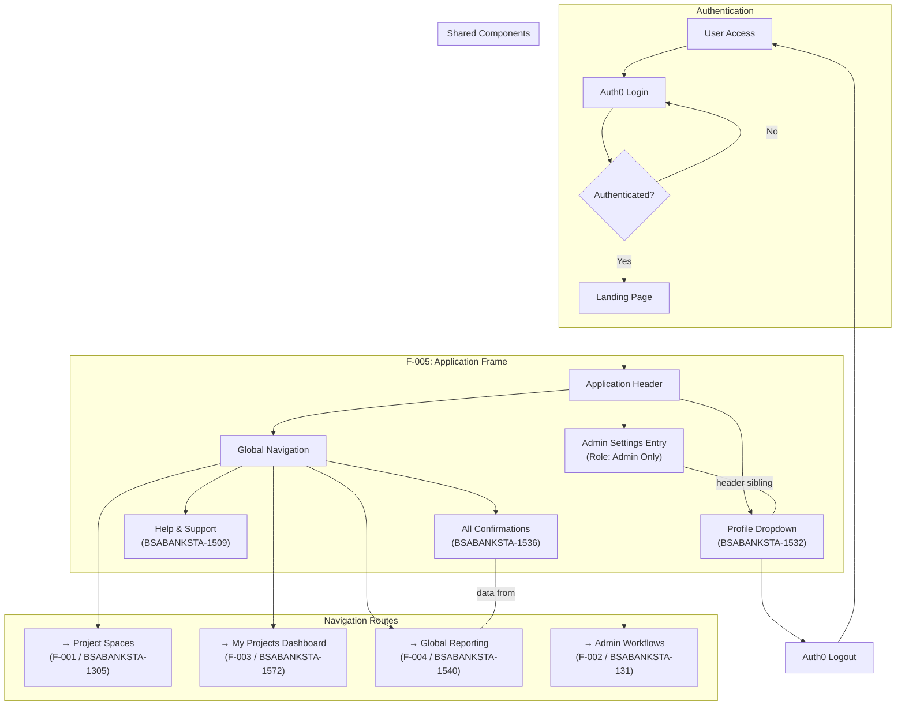

# EPIC-BSABANKSTA-1531: Application Frame and Global Navigation

> **Epic ID:** BSABANKSTA-1531
> **Batch:** 2 (New)
> **Feature Reference:** F-005 — Application Frame and Global Navigation
> **Total Story Points:** 16
> **Figma Frames:** 4 across 3 stories
> **Status:** Draft — Ready for Refinement

---

## Epic Summary

### Strategic Goal

Establish the persistent application shell and navigation framework that serves as the unified entry point, routing layer, and user experience scaffold for the entire BSA Banking Confirmations system. This epic delivers the foundational application chrome — the Application Header, Global Navigation, Landing Page, Help & Support surface, and shared reporting shell — enabling seamless, role-aware access to all features across both Batch 1 (Project Space Management) and Batch 2 (Admin Persona, My Projects Dashboard, Global Reporting) epics. By providing a single, cohesive application frame, this epic eliminates fragmented navigation experiences and ensures that every BSA/AML compliance workflow is accessible through a consistent, discoverable, and secure interface.

### Business Context

BSA/AML compliance operations span multiple functional domains — project space management, administrative oversight, personalized dashboards, and cross-project reporting. Without a unified application frame, compliance analysts and administrators must navigate between disconnected views, increasing context-switching overhead and reducing operational efficiency during time-sensitive compliance workflows.

The Application Frame addresses this by delivering:

- **Unified Navigation**: A persistent header and navigation framework that routes authenticated users to all feature areas (Project Spaces, Dashboard, Reporting, Admin) without leaving the application context.
- **Role-Conditional Security Boundaries**: The persistent Application Header renders differently based on user role — BSA Administrators see all navigation options including Admin Settings; BSA Analysts see only standard navigation (Project Spaces, Dashboard, Reporting). This role-based rendering ensures that administrative functions are invisible to unauthorized users, reducing the attack surface and maintaining compliance with principle-of-least-privilege access patterns.
- **Configurable Help & Support**: An in-application Help & Support page with deployment-variable-driven content reduces external support overhead by providing contextual guidance directly within the compliance workflow. Content is configurable per deployment environment via system placeholders.
- **Shared Reporting Surface**: The All Confirmations Page serves as a shared surface between this epic (providing the navigation shell and page container) and the Global Views and Reporting epic (BSABANKSTA-1540, providing data aggregation logic). This shared surface enables cross-project confirmation visibility without duplicating navigation infrastructure.
- **Auth0 Session Management**: The Profile Dropdown integrates with the Auth0 identity provider to deliver session-aware user information, profile navigation, and secure logout capabilities.

This epic is the **most foundational Batch 2 epic** because all other features depend on the Application Frame for navigation routing. Without F-005, users cannot reach F-001 (Project Spaces), F-002 (Admin), F-003 (Dashboard), or F-004 (Reporting) through the application interface.

### Key Features to be Implemented

1. **Persistent Application Header** — A sticky top-of-page header bar containing the application logo/title, global navigation links, profile dropdown menu, and role-conditional admin settings integration. The header remains visible during scrolling and serves as the primary navigation anchor across all feature views.

2. **Global Navigation Framework** — Client-side routing infrastructure (React Router) providing navigation routes to:
   - Project Spaces (F-001 — BSABANKSTA-1305)
   - My Projects Dashboard (F-003 — BSABANKSTA-1572)
   - Global Reporting (F-004 — BSABANKSTA-1540)
   - Admin Settings (F-002 — BSABANKSTA-131, visible to BSA Administrators only)
   - Help & Support (this epic)
   - All Confirmations (this epic, shared with F-004)

3. **Landing Page** — The default authenticated entry point for the application. After successful Auth0 authentication, users are redirected to the Landing Page, which provides an overview or quick-access links to primary workflows. *(Note: No dedicated Figma frame exists for the Landing Page — a Generated UI Specification is required per Global Rule #8.)*

4. **Configurable Help & Support Page** — A content page displaying help resources, support contacts, and contextual guidance. All content is driven by configurable deployment variables (e.g., `[Application Name]`, `[Support Email]`, `[Help Content URL]`), allowing each deployment environment to customize the support experience without code changes.

5. **All Confirmations Page** — A cross-project confirmation table with sortable columns and lazy load / infinite scroll (replacing traditional pagination per Global Rule #4 / CC-RQ-001). This page is a shared surface: the Application Frame epic provides the page shell, routing, and navigation context, while the Global Views and Reporting epic (BSABANKSTA-1540) provides the data aggregation backend and query logic.

6. **Profile Dropdown Menu** — A header-anchored dropdown menu displaying the authenticated user's profile summary (name, email, role), navigation links to profile settings, and a logout action that terminates the Auth0 session. The dropdown must coordinate with the Admin Settings dropdown (BSABANKSTA-131) in the shared Application Header to prevent simultaneous open states.

7. **Role-Based Navigation Rendering** — Conditional rendering logic that adjusts the visible navigation options based on the authenticated user's role:
   - **BSA Administrator**: Sees all navigation links including Admin Settings (System Messages, User Management, Integration Audit Trail)
   - **BSA Analyst**: Sees standard navigation only (Project Spaces, Dashboard, Reporting, Help & Support) — Admin Settings link is not rendered

### Out of Scope

The following items are explicitly excluded from this epic:

- **Mobile-specific layouts** — All views target desktop and responsive web only (per CC-RQ-003). No dedicated mobile breakpoints or native mobile patterns are included.
- **Traditional pagination** — Globally replaced by lazy load / infinite scroll across all list views (per Global Rule #4 / CC-RQ-001). No page-number pagination controls are implemented.
- **Batch 3+ feature navigation routes** — Only routes to the five currently identified epics are implemented. Future feature routes are out of scope.
- **Direct FinCEN/OFAC system integrations** — External regulatory system connections are not included in the navigation framework or any page within this epic.
- **Admin Settings dropdown implementation** — The Admin Settings dropdown menu and its child views (System Messages, User Management, Integration Audit Trail) belong to BSABANKSTA-131 (BSA Admin Persona epic). This epic provides only the header mounting point and role-conditional visibility toggle for the Admin Settings entry point.
- **Global reporting data aggregation logic** — The backend data aggregation, MongoDB aggregation pipelines, and cross-project query logic for the All Confirmations Page belong to BSABANKSTA-1540 (Global Views and Reporting epic). This epic provides only the page shell and navigation container.
- **Database schema migrations** — No database changes are in scope for this epic. All data consumed by this epic's views originates from collections managed by other epics.
- **Security architecture or authentication implementation details** — While Auth0 integration is referenced in the Profile Dropdown, the detailed security architecture, token management, and OIDC flow implementation are cross-cutting concerns documented separately.

### Figma Coverage Summary

| Coverage Status | Component | Details |
|----------------|-----------|---------|
| ✅ Figma Frame | Help & Support Page | 1 frame (`7542-109669`) |
| ✅ Figma Frame | All Confirmations Page | 1 frame (`8241-118805`) |
| ✅ Figma Frame | Profile Dropdown Menu | 2 frames (`8238-118805`, `8304-123177`) |
| ⚠️ No Figma Frame | Landing Page (`F-005-RQ-001`) | Generated UI Specification required per Global Rule #8 |
| ⚠️ No Figma Frame | Global Navigation Framework (`F-005-RQ-002`) | Generated UI Specification required per Global Rule #8 |

---

## User Stories Index

| Story ID | Title | Story Points | Figma Frames | File Path |
|----------|-------|:------------:|:------------:|-----------|
| BSABANKSTA-1509 | Configure Help & Support Page | 3 | 1 (`7542-109669`) | [STORY-BSABANKSTA-1509-configure-help-support-page.md](./STORY-BSABANKSTA-1509-configure-help-support-page.md) |
| BSABANKSTA-1536 | View All Confirmations | 8 | 1 (`8241-118805`) | [STORY-BSABANKSTA-1536-view-all-confirmations.md](./STORY-BSABANKSTA-1536-view-all-confirmations.md) |
| BSABANKSTA-1532 | Manage Profile Dropdown | 5 | 2 (`8238-118805`, `8304-123177`) | [STORY-BSABANKSTA-1532-manage-profile-dropdown.md](./STORY-BSABANKSTA-1532-manage-profile-dropdown.md) |

**Total Story Points: 16** (Fibonacci sum: 3 + 8 + 5)

### Stories Not Included (Covered by Other Epics or Implicit Requirements)

The following features are part of this epic's scope but are addressed as implicit requirements within the stories above or as cross-cutting concerns rather than standalone stories:

- **Landing Page** (`F-005-RQ-001`) — Addressed within the Global Navigation Framework and as a route target; Generated UI Specification required in relevant story files.
- **Global Navigation Framework** (`F-005-RQ-002`) — The navigation framework is a cross-cutting infrastructure component implemented across all three stories; each story contributes navigation elements that compose the unified framework.

---

## Dependencies

### Epics This Epic Depends On

| Epic ID | Epic Name | Batch | Dependency Type | Description |
|---------|-----------|:-----:|-----------------|-------------|
| BSABANKSTA-1305 | Create/Modify Project Space | 1 | Data Producer | Navigation routing requires project space feature to exist as a route target. The All Confirmations Page (BSABANKSTA-1536) aggregates confirmation data originating from project space entities managed by F-001. Without F-001, the Application Frame has no project data to route to or display. |
| Auth0 | Auth0 Identity Provider | External Service | Authentication & Session | Profile Dropdown (BSABANKSTA-1532) and the entire authenticated routing flow depend on Auth0 for identity verification, session management, JWT token issuance, and logout functionality. The Auth0 SPA SDK (`@auth0/auth0-react`) powers the authentication guard on all routes. |

### Epics That Depend On This Epic

| Epic ID | Epic Name | Batch | Dependency Type | Description |
|---------|-----------|:-----:|-----------------|-------------|
| BSABANKSTA-1305 | Create/Modify Project Space | 1 | Navigation Routing | The Application Frame provides the navigation route to project space views. Users access F-001 through the Global Navigation links rendered in the persistent Application Header. |
| BSABANKSTA-131 | BSA Admin Persona | 2 | Shared Application Header | Admin Settings (BSABANKSTA-1500) is mounted in the same Application Header bar as Profile Dropdown (BSABANKSTA-1532). Both components share the header container and must coordinate dropdown open/close states. The Admin Settings entry point visibility depends on the role-conditional rendering logic implemented in this epic. |
| BSABANKSTA-1572 | My Projects Dashboard | 2 | Navigation Routing | The Application Frame provides the navigation route to the My Projects Dashboard. Users access F-003 through the Global Navigation links rendered in the persistent Application Header. |
| BSABANKSTA-1540 | Global Views and Reporting | 2 | Shared Surface + Navigation Routing | The Application Frame provides: (a) the navigation route to reporting views, and (b) the All Confirmations Page shell (BSABANKSTA-1536) as a shared surface where F-005 provides the page container, table UI, and navigation context, while F-004 (BSABANKSTA-1540) provides the data aggregation backend and query logic. |

### Story-Level Dependency Map

| Source Story (This Epic) | Target Story / Epic | Dependency Type | Description |
|--------------------------|--------------------:|-----------------|-------------|
| BSABANKSTA-1532 (Manage Profile Dropdown) | BSABANKSTA-1500 (Manage User Library, BSABANKSTA-131) | Shared Application Header | Profile Dropdown and Admin Settings are sibling components in the Application Header bar. They must implement mutual exclusion for dropdown open states — opening one closes the other. Both share the same header layout context. |
| BSABANKSTA-1536 (View All Confirmations) | BSABANKSTA-1540 (Global Views and Reporting) | Shared Surface | F-005 provides the All Confirmations page shell, navigation integration, table UI rendering, and infinite scroll behavior. F-004 provides the data aggregation backend, MongoDB aggregation pipelines, and cross-project query logic. Implementation requires coordination between the frontend page component (this epic) and the API/data layer (BSABANKSTA-1540). |
| BSABANKSTA-1536 (View All Confirmations) | BSABANKSTA-1305 (Create/Modify Project Space) | Data Dependency | Confirmation records displayed on the All Confirmations Page originate from project spaces managed by F-001. The table queries confirmation data that is created and maintained through the project space lifecycle. |
| BSABANKSTA-1509 (Configure Help & Support Page) | System Placeholders (Cross-cutting) | Configuration Dependency | Help & Support page content uses configurable deployment variables including `[Application Name]`, `[Support Email]`, `[Help Content URL]`, and other placeholders. These must resolve at runtime from environment configuration. |
| Global Navigation Framework | BSABANKSTA-1305, BSABANKSTA-1572, BSABANKSTA-1540 | Navigation Routing | The Global Navigation Framework provides client-side routes to all feature views: Project Spaces (F-001), My Projects Dashboard (F-003), and Global Reporting (F-004). Route definitions and navigation link rendering are implemented in this epic. |
| All stories (this epic) | CC-RQ-001 (Cross-cutting Requirement) | UI Pattern Dependency | All list views across this epic implement the Lazy Load / Infinite Scroll pattern using cursor-based data loading and React Intersection Observer API. No traditional pagination controls are rendered (per Global Rule #4). |

---

## System Placeholders

> **Global Rule #7 — Placeholder Management**: The following configurable variables are used by stories within this epic. All placeholders **MUST** be implemented as deployment-configurable environment variables — not hard-coded values. Each deployment environment (development, staging, production) may resolve these to different values.

| Placeholder | Usage Context | Description | Example Value |
|-------------|---------------|-------------|---------------|
| `[Application Name]` | Application Header, Help & Support Page, Landing Page, Browser Tab Title | The display name of the application shown in the persistent header, page titles, and help content. Must be configurable per deployment to support white-labeling or environment-specific branding. | `BSA Banking Confirmations` |
| `[Help Content URL]` | Help & Support Page (BSABANKSTA-1509) | Base URL or content identifier for the help/support content source. May point to an internal CMS, static content API, or documentation site depending on the deployment environment. | `https://help.example.com/bsa-confirmations` |
| `[Support Email]` | Help & Support Page (BSABANKSTA-1509) | Configurable support contact email address displayed on the Help & Support page. Varies by deployment environment and organizational support structure. | `bsa-support@example.com` |
| `[Company Logo URL]` | Application Header | Optional configurable URL for the company/organization logo displayed in the Application Header. If not provided, falls back to a default text-based application name display. | `https://cdn.example.com/logos/company-logo.svg` |
| `[Auth0 Domain]` | Profile Dropdown (BSABANKSTA-1532), Authentication Flow | Auth0 tenant domain used for authentication, session management, and logout. Deployment-specific — each environment connects to its own Auth0 tenant. | `bsa-confirmations.us.auth0.com` |
| `[Auth0 Client ID]` | Profile Dropdown (BSABANKSTA-1532), Authentication Flow | Auth0 application client ID for the SPA. Each deployment environment has a unique client ID registered in Auth0. | `a1b2c3d4e5f6g7h8i9j0` |
| `[Auth0 Audience]` | API Authentication | Auth0 API audience identifier used for JWT token validation. Configurable per deployment to match the backend API registration. | `https://api.bsa-confirmations.example.com` |
| `[API Base URL]` | All stories (API calls) | Base URL for the Flask backend API. Varies by deployment environment (localhost for development, internal URL for staging, public URL for production). | `https://api.bsa-confirmations.example.com/v1` |
| `[Privacy Policy URL]` | Profile Dropdown (BSABANKSTA-1532) | Link to the organization's privacy policy, displayed in the Profile Dropdown menu. Configurable per deployment. | `https://www.example.com/privacy` |
| `[Terms of Service URL]` | Profile Dropdown (BSABANKSTA-1532) | Link to the terms of service, optionally displayed in the Profile Dropdown or Help & Support page. | `https://www.example.com/terms` |

### Implementation Notes

- All placeholders must be injected via environment variables at build time (for static values) or runtime configuration (for dynamic values).
- The React application should consume these via a centralized configuration module (e.g., `src/config/appConfig.ts`) that reads from `import.meta.env` (Vite environment variables) or a runtime configuration endpoint.
- Auth0-related placeholders are consumed by the `@auth0/auth0-react` `Auth0Provider` component configuration.
- URL-type placeholders must be validated at application startup to ensure they resolve to accessible endpoints.

---

## Definition of Done (Epic-Level)

The following checklist defines the completion criteria for the entire BSABANKSTA-1531 epic. All items must be satisfied before the epic can be considered "Done."

### Functional Completeness

- [ ] All 3 user stories (BSABANKSTA-1509, BSABANKSTA-1536, BSABANKSTA-1532) are completed and accepted by the Product Owner
- [ ] All BDD acceptance criteria across all stories pass validation (Given/When/Then scenarios verified)
- [ ] Application Header renders correctly with the `[Application Name]` or `[Company Logo URL]` for all authenticated users
- [ ] Profile Dropdown Menu displays authenticated user's name, email, and role; provides settings navigation and logout action
- [ ] Role-conditional rendering verified:
  - [ ] BSA Administrator sees: all navigation links + Admin Settings entry point + Profile Dropdown
  - [ ] BSA Analyst sees: standard navigation links + Profile Dropdown only (Admin Settings entry point is NOT rendered)
- [ ] Global Navigation Framework routes correctly to all feature views:
  - [ ] F-001: Project Spaces (BSABANKSTA-1305)
  - [ ] F-002: Admin Settings (BSABANKSTA-131) — visible only to BSA Administrators
  - [ ] F-003: My Projects Dashboard (BSABANKSTA-1572)
  - [ ] F-004: Global Reporting (BSABANKSTA-1540)
  - [ ] Help & Support (this epic)
  - [ ] All Confirmations (this epic, shared with F-004)
- [ ] Landing Page is functional as the default authenticated entry point after Auth0 login redirect
- [ ] Help & Support Page renders configurable content with all `[Application Name]`, `[Support Email]`, and `[Help Content URL]` placeholders resolved correctly
- [ ] All Confirmations Page displays cross-project confirmation data with infinite scroll (no pagination controls rendered)
- [ ] Auth0 integration verified:
  - [ ] Login flow redirects to Auth0 and returns to Landing Page on success
  - [ ] Logout action terminates Auth0 session and redirects to login page
  - [ ] JWT tokens are correctly validated on protected routes

### Cross-Epic Integration

- [ ] Cross-epic dependency links verified bidirectionally with all 4 other epics:
  - [ ] BSABANKSTA-1305 (Create/Modify Project Space) — navigation routing and data dependency
  - [ ] BSABANKSTA-131 (BSA Admin Persona) — shared Application Header coordination
  - [ ] BSABANKSTA-1572 (My Projects Dashboard) — navigation routing
  - [ ] BSABANKSTA-1540 (Global Views and Reporting) — shared All Confirmations surface and navigation routing
- [ ] Shared Application Header coordination verified with BSABANKSTA-131:
  - [ ] Admin Settings dropdown and Profile Dropdown implement mutual exclusion (opening one closes the other)
  - [ ] Header layout accommodates both components without overflow or collision
- [ ] Shared All Confirmations Page surface verified with BSABANKSTA-1540:
  - [ ] Frontend page shell (this epic) correctly renders data provided by the reporting backend (BSABANKSTA-1540)
  - [ ] Infinite scroll triggers data fetching from the Global Reporting API

### Non-Functional Requirements

- [ ] All configurable placeholders (`[Application Name]`, `[Support Email]`, `[Help Content URL]`, `[Auth0 Domain]`, `[Auth0 Client ID]`, etc.) resolve correctly per deployment environment
- [ ] No pagination patterns exist across any view — all list views use lazy load / infinite scroll (CC-RQ-001)
- [ ] Page load performance meets NFR targets:
  - [ ] Initial page load < 3 seconds on standard broadband
  - [ ] Navigation transitions < 500ms (client-side routing)
  - [ ] Infinite scroll batch load < 1 second per batch
- [ ] WCAG 2.1 AA accessibility compliance verified across all pages and components:
  - [ ] Keyboard navigation through all interactive elements
  - [ ] Screen reader compatibility for navigation links, dropdowns, and table content
  - [ ] Sufficient color contrast ratios (4.5:1 minimum for text)
  - [ ] Focus indicators visible on all interactive elements

### Quality Assurance

- [ ] All Figma-to-implementation comparisons reviewed (4 frames across 3 stories):
  - [ ] Help & Support Page (`7542-109669`)
  - [ ] All Confirmations Page (`8241-118805`)
  - [ ] Profile Dropdown — Screen 1 (`8238-118805`)
  - [ ] Profile Dropdown — Screen 2 (`8304-123177`)
- [ ] Generated UI Specifications for Landing Page and Global Navigation Framework reviewed and approved by design team
- [ ] Unit tests pass for all components (React components via Vitest + @testing-library/react)
- [ ] API integration tests pass for all backend endpoints (pytest)
- [ ] BDD acceptance tests pass (behave for backend, Playwright for E2E)
- [ ] E2E test suite covering navigation flows passes:
  - [ ] Authenticated user lands on Landing Page after login
  - [ ] Navigation to each feature area works correctly
  - [ ] Role-based navigation visibility is enforced
  - [ ] Profile Dropdown opens/closes correctly
  - [ ] Logout terminates session and redirects
  - [ ] Infinite scroll loads additional data on All Confirmations Page
- [ ] Integration testing with downstream features passes:
  - [ ] Project Spaces (F-001) accessible via navigation
  - [ ] Dashboard (F-003) accessible via navigation
  - [ ] Admin Settings (F-002) accessible for administrators, hidden for analysts
  - [ ] Reporting (F-004) data renders on All Confirmations Page
- [ ] No console errors or warnings in production build
- [ ] Documentation is complete and reviewed

---

## Appendix: Mermaid Epic Workflow Diagram

---

*Document generated as part of Batch 2 documentation pipeline for the BSA Banking Confirmations system.*
*Figma Design Source: [BSA Wireframes](https://www.figma.com/design/6fQyfvBUqImyavY8Fw47FV/BSA-Wireframes)*
*Repository: `aud-tech-confirmations-blitzy`*
