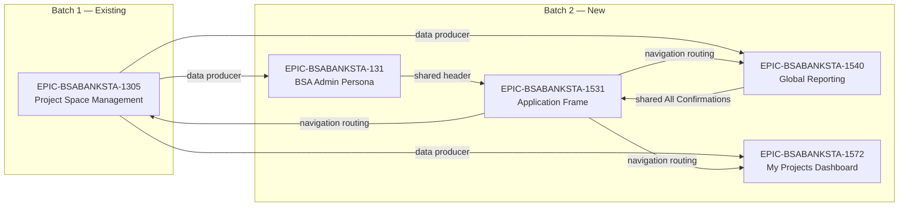

# Cross-Epic Dependency Graph — BSA Banking Confirmations

## Overview

This document serves as the **master dependency visualization** for the BSA Banking Confirmations system (`aud-tech-confirmations-blitzy`). It provides a single, authoritative view of the high-level dependency relationships between **all five epics** processed across Batch 1 and Batch 2 of the documentation generation pipeline.

The dependency graph captures three categories of inter-epic relationships:

- **Data Producer → Consumer**: Epics that create or manage core domain entities consumed by downstream epics
- **Navigation Routing**: The Application Frame epic that provides routing pathways to feature-specific views
- **Shared Components**: Epics that co-own UI components or shared surfaces within the application shell

---

## Epic Inventory

| Epic ID | Epic Name | Batch | Directory |
|---------|-----------|-------|-----------|
| `BSABANKSTA-1305` | Create/Modify Project Space | Batch 1 | `tickets/EPIC-BSABANKSTA-1305-create-modify-project-space/` |
| `BSABANKSTA-131` | BSA Admin Persona | Batch 2 | `tickets/EPIC-BSABANKSTA-131-admin-persona/` |
| `BSABANKSTA-1531` | Application Frame and Global Navigation | Batch 2 | `tickets/EPIC-BSABANKSTA-1531-application-frame-global-navigation/` |
| `BSABANKSTA-1540` | Global Views and Reporting | Batch 2 | `tickets/EPIC-BSABANKSTA-1540-global-views-reporting/` |
| `BSABANKSTA-1572` | My Projects Dashboard | Batch 2 | `tickets/EPIC-BSABANKSTA-1572-my-projects-dashboard/` |

---

## Dependency Graph

---

## Dependency Descriptions

| Source Epic | Target Epic | Dependency Type | Description |
|-------------|-------------|-----------------|-------------|
| `BSABANKSTA-1305` (Project Space Management) | `BSABANKSTA-131` (BSA Admin Persona) | Data Producer | Project space entities created and managed by F-001 are consumed by admin workflows including the Integration Audit Trail, which logs project space lifecycle events, and User Management, which operates within the context of project data. |
| `BSABANKSTA-1305` (Project Space Management) | `BSABANKSTA-1572` (My Projects Dashboard) | Data Producer | Project space entities are the primary data source for the personalized dashboard. The My Projects Dashboard displays project summary cards, status indicators, and action links derived from project spaces created through F-001. |
| `BSABANKSTA-1305` (Project Space Management) | `BSABANKSTA-1540` (Global Reporting) | Data Producer | Global Views and Reporting aggregates confirmation data across all project spaces managed by F-001. Report views and cross-project data consolidation depend on the project space entity structure and lifecycle states. |
| `BSABANKSTA-1531` (Application Frame) | `BSABANKSTA-1305` (Project Space Management) | Navigation Routing | The Application Frame provides the persistent navigation shell that routes users to the Project Space Management views. Global navigation entries and sidebar/header links direct to project space CRUD interfaces. |
| `BSABANKSTA-1531` (Application Frame) | `BSABANKSTA-1572` (My Projects Dashboard) | Navigation Routing | The Application Frame routes users to the My Projects Dashboard as the primary landing experience. Navigation entries and routing configuration direct authenticated users to their personalized project dashboard view. |
| `BSABANKSTA-1531` (Application Frame) | `BSABANKSTA-1540` (Global Reporting) | Navigation Routing | The Application Frame provides navigation routing to Global Views and Reporting pages. The All Confirmations Page entry in the navigation directs users to cross-project report views powered by F-004. |
| `BSABANKSTA-131` (BSA Admin Persona) | `BSABANKSTA-1531` (Application Frame) | Shared Component | The BSA Admin Persona's Admin Settings functionality is hosted within the Application Header component, which is owned by the Application Frame epic. Admin menu items coexist alongside the Profile Dropdown in the shared header. |
| `BSABANKSTA-1540` (Global Reporting) | `BSABANKSTA-1531` (Application Frame) | Shared Surface | The All Confirmations Page is a shared surface where F-004 (Global Reporting) provides the data aggregation logic and F-005 (Application Frame) provides the navigation container and page routing. Both epics contribute to this view. |

---

## Shared Components

### Application Header

The Application Header is a **shared UI component** co-owned by two epics:

- **`BSABANKSTA-131` (BSA Admin Persona)**: Contributes the Admin Settings menu within the header, visible only to users with the BSA Administrator role. Includes navigation to System Message management (`BSABANKSTA-1579`) and User Management (`BSABANKSTA-1500`).
- **`BSABANKSTA-1531` (Application Frame)**: Contributes the Profile Dropdown Menu (`BSABANKSTA-1532`) within the header, visible to all authenticated users. Includes profile summary, settings links, and logout action.

Both components render as sibling elements within the same Application Header bar, creating a mutual dependency that must be coordinated during implementation.

### All Confirmations Page

The All Confirmations Page is a **shared surface** between two epics:

- **`BSABANKSTA-1540` (Global Reporting)**: Serves as the data provider — defines the cross-project aggregation logic, data queries, and confirmation data structure that populates the page.
- **`BSABANKSTA-1531` (Application Frame)**: Serves as the navigation container — hosts the page within the application routing framework and provides the `BSABANKSTA-1536` story that defines navigation access, page layout, and infinite scroll behavior.

Story `BSABANKSTA-1536` (All Confirmations Page, in F-005) must cross-reference the F-004 reporting data logic to ensure alignment between the navigation surface and the data aggregation backend.

### Lazy Load / Infinite Scroll (CC-RQ-001)

Lazy load with infinite scroll is a **cross-cutting UI pattern** that replaces all traditional pagination across the application. Per Global Rule #4, every list-view story across all four Batch 2 epics must implement cursor-based data loading with the React Intersection Observer API.

**Affected epics:**

| Epic | Affected Stories |
|------|-----------------|
| `BSABANKSTA-131` (BSA Admin Persona) | User Management Library (`BSABANKSTA-1500`), Integration Audit Trail (`BSABANKSTA-1458`) |
| `BSABANKSTA-1572` (My Projects Dashboard) | All dashboard list views displaying project cards |
| `BSABANKSTA-1540` (Global Reporting) | All report views and global confirmation lists |
| `BSABANKSTA-1531` (Application Frame) | All Confirmations Page (`BSABANKSTA-1536`) |

### Project Space Entities

Project Space entities managed by `BSABANKSTA-1305` (Batch 1) represent the **foundational data dependency** for the majority of Batch 2 features:

- **`BSABANKSTA-131`**: Admin workflows (audit trail, user management) operate on and reference project space data.
- **`BSABANKSTA-1572`**: The My Projects Dashboard renders project space summaries as its primary content.
- **`BSABANKSTA-1540`**: Global reporting aggregates data across all project spaces for organizational-level views.

All three consuming epics must declare an explicit data dependency on `BSABANKSTA-1305` in their respective epic and story files.

---

## Integration Notes

### Bidirectional Traceability

Every dependency documented in the graph above must be reflected **bidirectionally** in the corresponding epic and story files:

- **Forward references** (Batch 1 → Batch 2): The `EPIC-BSABANKSTA-1305-create-modify-project-space.md` file must include dependency links pointing to all four Batch 2 epics that consume its project space entities or receive navigation routing.
- **Backward references** (Batch 2 → Batch 1): Every Batch 2 epic file and its child story files must include `### Dependencies` sections that reference `BSABANKSTA-1305` where applicable.

### Cross-Batch Reference Pattern

When documenting dependencies in story files, use the following reference format:

- **Epic-level**: `Depends on EPIC-BSABANKSTA-[ID] ([Epic Name])` — for architectural or data-model dependencies
- **Story-level**: `Depends on STORY-BSABANKSTA-[ID] ([Story Name])` — for specific functional dependencies between individual stories

### Story-Level Dependency Mapping

This graph captures **epic-level** (high-level) dependencies only. Detailed **story-level** dependency mappings — including specific inter-story references across epic boundaries — are documented within each individual story file's `### Dependencies` section. Refer to the following story files for the most granular dependency information:

| Story | Epic | Key Cross-Epic Dependencies |
|-------|------|-----------------------------|
| `BSABANKSTA-1579` (Manage Global System Messages) | 131 | Application Header component in `BSABANKSTA-1531` |
| `BSABANKSTA-1500` (Manage User Library) | 131 | Profile Dropdown (`BSABANKSTA-1532`) in `BSABANKSTA-1531` — shared Application Header |
| `BSABANKSTA-1458` (View Integration Audit Trail) | 131 | Project Space entities in `BSABANKSTA-1305` |
| `BSABANKSTA-1509` (Configure Help and Support Page) | 1531 | System Placeholders shared across all epics |
| `BSABANKSTA-1536` (View All Confirmations) | 1531 | Global Reporting data logic in `BSABANKSTA-1540` |
| `BSABANKSTA-1532` (Manage Profile Dropdown) | 1531 | Admin Settings (`BSABANKSTA-1500`) in `BSABANKSTA-131` — shared Application Header |
| All Dashboard stories | 1572 | Project Space CRUD in `BSABANKSTA-1305` |
| All Reporting stories | 1540 | Project Space entities in `BSABANKSTA-1305` |

---

*This dependency graph is maintained as a living document. It must be updated whenever new epics are added, existing dependencies change, or additional cross-epic integration points are identified during refinement or implementation.*
